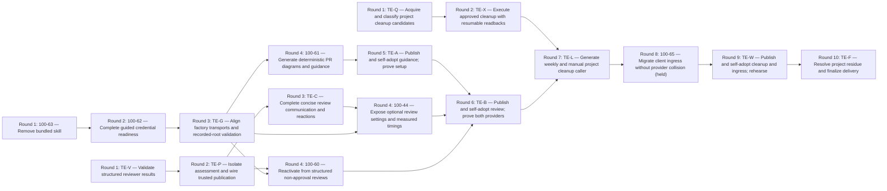

# Template enhancements: delivery plan

Planning ticket [100-67](https://linear.app/1000lines/issue/100-67), for the
[client-template enhancement goal](https://linear.app/1000lines/project/symphony-client-template-enhancements-c24c56d5ad02).
Authority: [accepted R1–R9 / AC1–AC12](template-enhancements-design.md), merged in
[template #7](https://github.com/1000lines/symphony-client-template/pull/7) at `ebf20fd`.
This is a proposal for human review. Only 100-68 may execute accepted fan-out;
100-67 creates no implementation tickets, release, deployment or cleanup.

**17 outcomes: 11 new tickets and six reused tickets; ten dependency rounds.**
Three checkpoints publish reviewed increments, update the root through Copier,
review the generated diff and exercise delivered behavior. Finalization follows.
Line estimates below count additions/deletions across code, YAML, prose and tests;
they are review estimates, not quotas. Existing PR estimates describe their
remaining bounded remit, not a request to rewrite delivered work.

| Node | Outcome / owner                                           | Estimate + / − | Difficulty |
| ---- | --------------------------------------------------------- | -------------- | ---------- |
| K    | Existing 100-63: remove bundled skill                     | 80 / 320       | easy       |
| O    | Existing 100-62: guided credential readiness              | 650 / 70       | hard       |
| D    | Existing 100-61: deterministic PR diagram and guidance    | 630 / 50       | hard       |
| G    | TE-G: consistent factory transports and concise guidance  | 280 / 380      | hard       |
| A    | TE-A: publish/adopt guidance and prove human setup        | 180 / 180      | hard       |
| V    | TE-V: validate structured reviewer results                | 650 / 30       | hard       |
| P    | TE-P: isolate assessment and wire trusted publication     | 550 / 400      | hard       |
| C    | TE-C: compact communication, readiness and reactions      | 450 / 200      | hard       |
| N    | Existing 100-60: structured non-approval reactivation     | 300 / 150      | hard       |
| T    | Existing 100-44: optional settings and measured timings   | 350 / 120      | hard       |
| B    | TE-B: publish/adopt review and prove both providers       | 200 / 200      | hard       |
| Q    | TE-Q: acquire and classify cleanup candidates             | 750 / 0        | hard       |
| X    | TE-X: approved, resumable cleanup execution               | 850 / 0        | hard       |
| L    | TE-L: generated weekly/manual cleanup caller              | 250 / 20       | easy       |
| I    | Existing 100-65: migrate client ingress without collision | 380 / 250      | hard       |
| W    | TE-W: publish/adopt cleanup and ingress; live rehearsal   | 220 / 180      | hard       |
| F    | TE-F: resolve project residue and finalize delivery       | 180 / 100      | hard       |

## Sources, current ownership and assumptions

Source audit September 11, 2026, 23:12 UTC: current project brief including all
five original note groups and factory correction; team 100's complete 65-issue listing;
100-44/57–69 descriptions, relevant comments, relations and PR associations.
The rework refresh checked current issue feedback, team states, main and
template #8/#9; their heads and the four Backlog candidates 100-44/60/61/65 are unchanged. No required planning source
was unavailable. The laptop notes are reproduced in project content; no laptop
or Google Docs access is needed.

| Source refreshed                                                                                         | Observed result and treatment                                                                                                                                                                                                                                                                 |
| -------------------------------------------------------------------------------------------------------- | --------------------------------------------------------------------------------------------------------------------------------------------------------------------------------------------------------------------------------------------------------------------------------------------- |
| Template `main@ebf20fd`                                                                                  | README, SYMPHONY, SELF-ADOPTION, provenance, answers, config, factory/GraphQL resources, review callers and tests read. Design #7 and migration #10 are merged. No generated PR template; factory guidance still contradicts GraphQL fallback.                                                |
| Template [#8](https://github.com/1000lines/symphony-client-template/pull/8), 100-62                      | Draft `659fc98`, issue Inactive; fresh human request covers org/repo settings, with screenshots supplied to its owner. Existing owner handles that evidence and provisioning; this plan does not repeat setup implementation.                                                                 |
| Template [#9](https://github.com/1000lines/symphony-client-template/pull/9), 100-63                      | Open, ready, `966195a`; preserve removal and customized-file exclusions. K hands shared files to O, then G and D.                                                                                                                                                                             |
| Template [#10](https://github.com/1000lines/symphony-client-template/pull/10), 100-57                    | Merged `0e04431`; issue Done. CI/wakeup alpha migration is delivered source. Remaining publication/root operational proof stays with 100-57; do not reopen or duplicate it.                                                                                                                   |
| Template [#6](https://github.com/1000lines/symphony-client-template/pull/6), 100-64                      | Merged `d2dd1dd`; issue Done. Current root records template `e8d6f36` and review workflow/helpers `ac15fc1`.                                                                                                                                                                                  |
| Workflows [#2](https://github.com/1000lines/symphony-client-workflows/pull/2), 100-64                    | Still draft `ac15fc1`; workflow main/alpha `77cfb2d`. P must consume its accepted interfaces on main; no predecessor commits copied into P. Existing owner/Jeremy supplies acceptance/publication, not a duplicate provider ticket.                                                           |
| Publication refs                                                                                         | Template alpha `58021a7`; workflow alpha `77cfb2d`. These lag source. Resolve again at every checkpoint; neither source merge nor Linear Done proves release, installation or execution.                                                                                                      |
| [100-58](https://linear.app/1000lines/issue/100-58), [100-59](https://linear.app/1000lines/issue/100-59) | Inactive/Active in the earlier project; [example #50](https://github.com/1000lines/symphony-example/pull/50) draft `39a87e5`. Preserve example adoption, both-consumer census, native/Docker/remote, recovery and retirement obligations; no new example implementation here.                 |
| [100-69](https://linear.app/1000lines/issue/100-69)                                                      | Separate Misc owner for publication-label reliability. Consume its correction; no duplicate helper or extra gate.                                                                                                                                                                             |
| Historical example #6/#11/#16/#32/#36/#40/#48/#49                                                        | All merged; refreshed PRs and Jeremy's feedback. Retain concise reusable comment, human authority, no legend, diagram threshold, diff collapse and the #48/#49 regressions. Old canceled/deferred controller work is excluded.                                                                |
| Historical design/fan-out                                                                                | Example `docs/symphony-plans/client-template-design.md` and `fan-out-plan-100-39-client-template.md`: retain existing ownership and moving-alpha decisions. New accepted design supersedes old no-update/provider-selection restrictions.                                                     |
| Shared planning/proof                                                                                    | `$SYMPHONY_TOOLING_ROOT/docs/symphony-plans/{README,fan-out-plan-schema,fan-out-criteria}.md`, `tools/symphony-dag/`, proof-of-work, PR and Cadence acceptance guides read. Target has only its project design under this directory; generic guides remain shared. No schema/criteria change. |

R1/R2 map to V/P/C/N/B; R3 to T/B and existing O/100-64; R4 to D/G/A;
R5 to Q/X/L/W; R6 to K/G/D/F; R7 to A/B/W; R8 to G/A; R9 to I/W.
Thus every original note and AC has an owner. Credential values, App grants,
compatible model/effort values and observed workflow IDs are execution inputs;
their absence gates only dependent operations. No new product decision is required.

Reuse K/O without moving projects or replacing PRs. Reuse D/N/T/I in **Misc**,
preserving labels and current Backlog. D/N retain the human Copier-readiness hold:
before activation, verify 100-57's published Git-URL render and actual root use,
or obtain Jeremy's explicit hold release; a Done label alone is insufficient.
I requires Jeremy's explicit release of its **Misc/Backlog** hold; this plan does
not request a move. T remains parked until accepted fan-out commissions its
existing scope. New tickets use cyan; existing Misc PRs use that project's
verified color (currently blue), never an inferred cyan override. Assign new
tickets/PRs to Jeremy; resolve existing unassigned tickets during accepted fan-out.

## Breakdown and dependencies

One large PR per theme would combine source decisions, privileged wiring and live
proof into difficult reviews. Splitting every helper/caller into separate tickets
would add handoffs without independent outcomes. This plan keeps small contracts
and cleanup eligibility separate from their side effects, reuses the four backlog
owners, and batches publication/adoption into three useful increments.

The longest path is K–O–G–D–A–B–L–I–W–F: **ten nodes**, not an elapsed-time
forecast. Review and cleanup implementation can progress alongside guidance.
Compared with the initial eight-round proposal, G must establish recorded-root
validation before D adds generated files. Keeping that prerequisite in G avoids
expanding the underway K/O PRs; D then owns its invocation link in SYMPHONY.
L follows B and precedes I so inventory writers remain ordered and cleanup enters
the third adoption milestone. These two extra rounds preserve the three coherent
milestones without weakening tests or combining unrelated changes into one PR.

Template `tests/test_render.py` writers are ordered **K→O→G→D→B→L→I** (D→B via A).
G verifies the recorded root independently; D/L/I each update the strict current
render inventory and affected assertions in the same PR as their generated files.
A/B/W adopt successively; only their assigned generated root paths may change.
K/O order remaining reconciliation/acceptance of shared SYMPHONY/tests, not
retroactive changes to their open PRs. G→N/T supplies recorded-root validation for
source-only caller/guidance edits; C→T hands off shared review files. B→L also
keeps cleanup additions out of the earlier published review baseline. A/B/W
serialize publication refs and root proof resources. Every edge is a hard artifact
or ownership handoff; no transitive edge is duplicated. Fan-in uses direct relations.

## DAG



## Manifest and branch declarations

The branch/PR objects below are the branch manifest. New branches are born on
dispatch from main and open draft PRs against main. Existing branch refs identify
current PRs; future Misc branches retain Misc identity. No branch contains
predecessor work absent from its own repository's main.

```yaml
schema: symphony-dag-manifest/v1
project:
  code: template-enhancements
  color: cyan
  base_branch: main
  human_lead: Jeremy Carroll
  human_lead_github: jeremycarroll
  linear_issue_labels: [cyan]
  github_pr_labels: [symphony, cyan]
defaults:
  initial_state: Active
  maturity_label: mature
  task_branch_base: main
  task_pr_base: main
  task_pr_draft: true
  issue_assignee: Jeremy Carroll
  pr_assignee: jeremycarroll
  relation_type: blocks
  edge_semantics: hard_artifact_and_ownership_handoff
  mutation_policy: stage_Backlog_verify_relations_then_activate_preserve_holds
nodes:
  - id: K
    existing_issue: 100-63
    issue_id: 2216a540-0707-4770-8d38-99514e9a7246
    title: "Remove bundled skill"
    type: existing_task
    difficulty: easy
    initial_state: Inactive
    labels: []
    branch:
      {
        ref: "symphony/template-enhancements/100-63/remove-karpathy",
        base: main,
        birth: existing,
      }
    pr:
      {
        url: "https://github.com/1000lines/symphony-client-template/pull/9",
        create: on_branch_birth,
        base: main,
        draft: true,
        labels: [symphony, cyan],
      }
  - id: O
    existing_issue: 100-62
    issue_id: db444d98-498c-4e10-b751-b4fa784431b1
    title: "Complete guided credential readiness"
    type: existing_task
    difficulty: hard
    initial_state: Inactive
    labels: []
    branch:
      {
        ref: "symphony/misc/100-62/cadence-onboarding",
        base: main,
        birth: existing,
      }
    pr:
      {
        url: "https://github.com/1000lines/symphony-client-template/pull/8",
        create: on_branch_birth,
        base: main,
        draft: true,
        labels: [symphony, cyan],
      }
  - id: D
    existing_issue: 100-61
    issue_id: 43a896b1-42ab-4d15-be78-e8e9fd74fb4e
    title: "Generate deterministic PR diagrams and guidance"
    type: existing_task
    difficulty: hard
    initial_state: Backlog
    labels: ["Bug"]
    branch:
      {
        template: "symphony/misc/${issue}/pr-progress",
        base: main,
        birth: on_dispatch,
      }
    pr:
      {
        create: on_branch_birth,
        base: main,
        draft: true,
        labels: [symphony, blue],
      }
  - id: G
    payload_key: TE-G
    title: "Align factory transports and recorded-root validation"
    type: task
    difficulty: hard
    initial_state: Active
    labels: ["cyan"]
    branch:
      {
        template: "symphony/template-enhancements/${issue}/factory-guidance",
        base: main,
        birth: on_dispatch,
      }
    pr:
      {
        create: on_branch_birth,
        base: main,
        draft: true,
        labels: [symphony, cyan],
      }
  - id: A
    payload_key: TE-A
    title: "Publish and self-adopt guidance; prove setup"
    type: task
    difficulty: hard
    initial_state: Active
    labels: ["cyan"]
    branch:
      {
        template: "symphony/template-enhancements/${issue}/adopt-guidance",
        base: main,
        birth: on_dispatch,
      }
    pr:
      {
        create: on_branch_birth,
        base: main,
        draft: true,
        labels: [symphony, cyan],
      }
  - id: V
    payload_key: TE-V
    title: "Validate structured reviewer results"
    type: task
    difficulty: hard
    initial_state: Active
    labels: ["cyan"]
    branch:
      {
        template: "symphony/template-enhancements/${issue}/review-result",
        base: main,
        birth: on_dispatch,
      }
    pr:
      {
        create: on_branch_birth,
        base: main,
        draft: true,
        labels: [symphony, cyan],
      }
  - id: P
    payload_key: TE-P
    title: "Isolate assessment and wire trusted publication"
    type: task
    difficulty: hard
    initial_state: Active
    labels: ["cyan"]
    branch:
      {
        template: "symphony/template-enhancements/${issue}/trusted-review",
        base: main,
        birth: on_dispatch,
      }
    pr:
      {
        create: on_branch_birth,
        base: main,
        draft: true,
        labels: [symphony, cyan],
      }
  - id: C
    payload_key: TE-C
    title: "Complete concise review communication and reactions"
    type: task
    difficulty: hard
    initial_state: Active
    labels: ["cyan"]
    branch:
      {
        template: "symphony/template-enhancements/${issue}/review-completion",
        base: main,
        birth: on_dispatch,
      }
    pr:
      {
        create: on_branch_birth,
        base: main,
        draft: true,
        labels: [symphony, cyan],
      }
  - id: N
    existing_issue: 100-60
    issue_id: dc5d7ff5-7807-41ab-b90c-5fedd92f6b21
    title: "Reactivate from structured non-approval reviews"
    type: existing_task
    difficulty: hard
    initial_state: Backlog
    labels: ["Bug"]
    branch:
      {
        template: "symphony/misc/${issue}/non-approval",
        base: main,
        birth: on_dispatch,
      }
    pr:
      {
        create: on_branch_birth,
        base: main,
        draft: true,
        labels: [symphony, blue],
      }
  - id: T
    existing_issue: 100-44
    issue_id: 8d2326f1-7053-4767-8b78-c48ec087cae0
    title: "Expose optional review settings and measured timings"
    type: existing_task
    difficulty: hard
    initial_state: Backlog
    labels: ["blue", "Improvement"]
    branch:
      {
        template: "symphony/misc/${issue}/review-settings",
        base: main,
        birth: on_dispatch,
      }
    pr:
      {
        create: on_branch_birth,
        base: main,
        draft: true,
        labels: [symphony, blue],
      }
  - id: B
    payload_key: TE-B
    title: "Publish and self-adopt review; prove both providers"
    type: task
    difficulty: hard
    initial_state: Active
    labels: ["cyan"]
    branch:
      {
        template: "symphony/template-enhancements/${issue}/adopt-review",
        base: main,
        birth: on_dispatch,
      }
    pr:
      {
        create: on_branch_birth,
        base: main,
        draft: true,
        labels: [symphony, cyan],
      }
  - id: Q
    payload_key: TE-Q
    title: "Acquire and classify project cleanup candidates"
    type: task
    difficulty: hard
    initial_state: Active
    labels: ["cyan"]
    branch:
      {
        template: "symphony/template-enhancements/${issue}/cleanup-candidates",
        base: main,
        birth: on_dispatch,
      }
    pr:
      {
        create: on_branch_birth,
        base: main,
        draft: true,
        labels: [symphony, cyan],
      }
  - id: X
    payload_key: TE-X
    title: "Execute approved cleanup with resumable readbacks"
    type: task
    difficulty: hard
    initial_state: Active
    labels: ["cyan"]
    branch:
      {
        template: "symphony/template-enhancements/${issue}/cleanup-execution",
        base: main,
        birth: on_dispatch,
      }
    pr:
      {
        create: on_branch_birth,
        base: main,
        draft: true,
        labels: [symphony, cyan],
      }
  - id: L
    payload_key: TE-L
    title: "Generate weekly and manual project cleanup caller"
    type: task
    difficulty: easy
    initial_state: Active
    labels: ["cyan"]
    branch:
      {
        template: "symphony/template-enhancements/${issue}/cleanup-caller",
        base: main,
        birth: on_dispatch,
      }
    pr:
      {
        create: on_branch_birth,
        base: main,
        draft: true,
        labels: [symphony, cyan],
      }
  - id: I
    existing_issue: 100-65
    issue_id: bb02cc03-4877-4c8e-add0-043cd6b32986
    title: "Migrate client ingress without provider collision"
    type: existing_task
    difficulty: hard
    initial_state: Backlog
    labels: ["Bug"]
    branch:
      {
        template: "symphony/misc/${issue}/client-ingress",
        base: main,
        birth: on_dispatch,
      }
    pr:
      {
        create: on_branch_birth,
        base: main,
        draft: true,
        labels: [symphony, blue],
      }
  - id: W
    payload_key: TE-W
    title: "Publish and self-adopt cleanup and ingress; rehearse"
    type: task
    difficulty: hard
    initial_state: Active
    labels: ["cyan"]
    branch:
      {
        template: "symphony/template-enhancements/${issue}/adopt-cleanup",
        base: main,
        birth: on_dispatch,
      }
    pr:
      {
        create: on_branch_birth,
        base: main,
        draft: true,
        labels: [symphony, cyan],
      }
  - id: F
    payload_key: TE-F
    title: "Resolve project residue and finalize delivery"
    type: finalize
    difficulty: hard
    initial_state: Active
    labels: ["cyan"]
    branch:
      {
        template: "symphony/template-enhancements/${issue}/finalize",
        base: main,
        birth: on_dispatch,
      }
    pr:
      {
        create: on_branch_birth,
        base: main,
        draft: true,
        labels: [symphony, cyan],
      }
edges:
  - { from: K, to: O }
  - { from: O, to: G }
  - { from: G, to: D }
  - { from: D, to: A }
  - { from: V, to: P }
  - { from: P, to: C }
  - { from: P, to: N }
  - { from: G, to: N }
  - { from: C, to: T }
  - { from: G, to: T }
  - { from: A, to: B }
  - { from: T, to: B }
  - { from: N, to: B }
  - { from: Q, to: X }
  - { from: X, to: L }
  - { from: B, to: L }
  - { from: L, to: I }
  - { from: I, to: W }
  - { from: W, to: F }
```

## Decisions

| Decision                                                  | Rationale and enforcing owner                                                                                                                                                                                                                                                                         |
| --------------------------------------------------------- | ----------------------------------------------------------------------------------------------------------------------------------------------------------------------------------------------------------------------------------------------------------------------------------------------------- |
| D1: structured result, read-only reviewer, trusted writes | R1: V validates; P invokes existing providers without write credentials and persists through the current ledger before publication. No new controller schema or second finding history.                                                                                                               |
| D2: explicit new-verdict handoff                          | R2: N consumes correlated records from P. Missing/stale records diagnose and request a fresh review, never parse prose into authority. C owns readiness and completion reactions.                                                                                                                     |
| D3: key-driven providers and observed settings            | R3/100-64 supersede earlier selected-answer behavior. T retains eight answers, optional settings, fast default, no auth fallback; B proves both providers at one unchanged head.                                                                                                                      |
| D4: deterministic client PR presentation                  | D reuses shared parser, separates fetching/rendering, uses state rather than checkpoint prose, keeps current highlight independent, omits graphs below three nodes or two edges. D links invocation after G hands off SYMPHONY; A proves use.                                                         |
| D5: reviewed cleanup eligibility before execution         | Q/X implement accepted R5 exactly; L is thin. Human approval of a specific candidate set and protected environment precede mutations; W proves controlled operation.                                                                                                                                  |
| D6: small guidance with transport parity                  | G follows R8, consumes K/O, preserves preflight/staging/readback and hosted auth. ≤120 lines per focused skill/SYMPHONY, ≤160 per focused reference; D's PR template ≤60. Revise needlessly verbose prose toward 40% less without losing requirements.                                                |
| D7: publication and installed behavior are separate       | A/B/W own successive alpha/root handoffs, recording actual refs and live results; G establishes separate recorded-root/current-render tests before D; D/L/I maintain strict inventories in order. 100-57/58/59/64 keep outstanding obligations. No automatic release updater or self-referential SHA. |
| D8: direct blockers and clean main-based PRs              | Manifest/relation table and 100-68 enforce exact topology, staged creation/readback, retained holds and current-head review. No no-op join, special ancestry or implied blocker.                                                                                                                      |
| D9: one authoritative client ingress                      | I uses the accepted client filename/name and exact trust checks, preserves provider-owned files; W proves one review/handoff per event in adopted clients.                                                                                                                                            |
| D10: existing owners and bounded finalization             | F audits only this project, preserves 100-58/59 and 100-69, and uses existing replan rules for discoveries. No wholesale revival of earlier canceled work.                                                                                                                                            |

## Ticket execution contract

Copy this contract, the item's complete section, its validation profile and
incoming relation rows into each created/updated ticket. Link the accepted plan
commit and design IDs. Do not rely on the shared renderer's metadata-only body as
a complete task description. New keys TE-\* are placeholders, never Linear IDs.

Repositories: **T** = `1000lines/symphony-client-template`; **W** =
`1000lines/symphony-client-workflows`. All base/PR bases are **main**.
Unless listed otherwise, a node owns only its task branch, draft PR and workpad
externally; source repositories, shared settings and other PRs are read-only.
Owned directory prefixes below mean all newly introduced files there; they never
grant edits outside the listed area. `source_files` are the owned existing files,
accepted design sections cited per item and upstream accepted artifacts.

Hard dependencies require upstream code accepted on main and the named resource
handoff before dependent edits/tests. Read-only investigation or an independent
draft dependency note may proceed; never commit upstream code. Existing-source
acceptance and downstream live proof are separate checkpoints: downstream proof
assignments below do not erase original acceptance obligations. Each source
owner links its checkpoint evidence before claiming its full requirement done.
If a source ticket remains open for downstream proof, dispatch requires current
blocker maturity plus actual merged artifacts; maturity cannot waive missing code.

Every task validates **local → Docker if needed → mandatory current-head CI**,
including docs. Use its profile below plus targeted new tests. Fix assertions
before publishing; local pass means `Docker: skipped — passed locally`. Record
base/head, command, criterion, artifact, result, limitation and next owner;
CI workflow/event/ref, App, run/attempt and required child jobs are mandatory.
Missing/pending/skipped/canceled/stale CI never passes.

| Profile | Local; Docker fallback only for unavailable tools; mandatory CI                                                                                                                                                                                                                                                                                                                                                                                                                                        |
| ------- | ------------------------------------------------------------------------------------------------------------------------------------------------------------------------------------------------------------------------------------------------------------------------------------------------------------------------------------------------------------------------------------------------------------------------------------------------------------------------------------------------------ |
| T       | `python3 -m compileall -q tests`; Python 3.12.14 venv, `pip install -r tests/requirements.txt`, then from workspace parent `python -m unittest discover -s <checkout>/tests -v`. Run owned Node tests with `node --test <listed-test>` when added. Docker: pinned `python:3.12.14-slim-bookworm` with Git and those same commands; add Node 20.20.0 only for owned Node tests. `Client template tests`, `.github/workflows/ci.yml`, Actions App 15368; reread merged config for O's additional checks. |
| W       | Node 20.20.0, `npm ci`; listed `node --test` cases, then `npm test`. Docker: `node:20.20.0-bookworm-slim`, same commands. `Workflow tests`, `.github/workflows/ci.yml`, Actions App 15368.                                                                                                                                                                                                                                                                                                             |
| Docs    | Prettier 2.8.8 `--check <changed-markdown>` and `git diff --check`; relevant T/W checks for touched executable paths. Docker only for missing formatter runtime: `node:20.20.0-bookworm-slim`. Target's T/W required CI still runs on docs-only heads.                                                                                                                                                                                                                                                 |

Fallback invocation: from the issue workspace use
`docker run --rm --user "$(id -u):$(id -g)" -v "$PWD:/work" -w /work/<checkout> <resolved-image-digest> <command>`.
Prepare any missing Git in a task-local image before the unprivileged test run;
record the pulled/built digest. Mount only the issue workspace, no host secrets,
no exposed ports; remove task containers. Check newly observed required checks
against config/branch rules; Cadence remains advisory, not invented product CI.

Set blocker `mature` only after required current-head CI and configured Cadence
approval, closed mandatory feedback, a clean task branch and a ready PR. Record
reviewer, reviewed SHA, verdict and matching workpad; reread human reviews,
comments, threads, commits and Linear comments before handoff. New review-relevant
activity needs review again. Remove maturity for request-changes, rejected/stale
acceptance evidence or severe regression, not ordinary edits alone. Planning
seeds wait for human review/merge and Done; no early seed maturity.

Pending CI uses Unhappy + wake:15m; review/input uses Inactive; actionable failure
uses Active. Fail closed for missing required labels, states, assignee mapping,
branch refs, IDs, endpoints or relation direction. Human acceptance owns Done.
For missing admin access, prepare the reviewable change first; record repository,
App, exact operation/error, required grant, Jeremy's action and readback. No
alternate credentials or inferred deployment. There are no planned temporary
seams; any introduced seam needs existing `integration_pattern` and
`finalization_responsibility` fields before delivery, with F as final owner.

## Items

### K — 100-63: consume accepted skill removal

- **scope / owned_files:** existing T #9 owns removal of `template/.agents/skills/karpathy-guidelines/`, corresponding root skill files, template/root factory skill and SYMPHONY, `tests/test_render.py`, `PROVENANCE.md`, `SELF-ADOPTION.md`, `.copier-answers.yml`. Reconcile its accepted final diff, not a replacement ticket.
- **owned_external_resources:** existing #9 and its root update; no new settings or release-ref ownership. **dependencies:** none; hand shared template SYMPHONY/tests to O after acceptance, root adoption evidence to A.
- **acceptance_checks:** R6/AC8 removal, no dangling references, fresh render and existing-client preservation including edited deleted files. **validation:** T + Docs. **delivery_notes / exclusions:** retain original owner, branch and absence of personal/global changes; no replacement skill.

### O — 100-62: finish guided credential readiness

- **scope / owned_files:** retain T #8's `.github/workflows/ci.yml`, `.symphony.cfg.json`, `README.md`, `template/.agents/skills/cadence-onboarding/`, `template/.github/workflows/symphony-client-setup.yml.jinja`, `template/SYMPHONY.md.jinja`, `tests/test-credentials.mjs`, `tests/test_render.py`.
- **owned_external_resources:** existing #8; Jeremy owns actual org/repo secrets/variables and `cadence-controller` grants. O verifies names/effective delivery without values; A receives exclusive root setup/rehearsal use afterward.
- **dependencies:** K accepted removal before final SYMPHONY/test reconciliation. **acceptance_checks:** existing issue and fresh #8 settings feedback, both-key/either-key/neither cases, real delivery/probes honestly separated from review execution. **validation:** T, `node --test tests/test-credentials.mjs`.
- **delivery_notes / exclusions:** provisioning only; 100-64 retains provider implementation. Hand generated guidance to G; keep original live-readiness obligations and reuse A/B evidence where refs match.

### D — 100-61: generate PR diagrams and concise guidance

- **scope:** R4/AC6: deterministic rendering and actual creation/refresh invocation, reproducing #49's Done-with-pending-prose regression.
- **owned_files:** T `template/scripts/symphony/render-pr-progress.mjs`, `template/scripts/symphony/fetch-pr-progress.mjs`, `template/.github/pull_request_template.md`, `template/docs/engineering/symphony/pull-requests.md`, `tests/test-pr-progress.mjs`, `tests/test_pr_guidance.py` (new), `tests/test_render.py`, `template/SYMPHONY.md.jinja` (creation/refresh link only, after G). Reuse the installed shared parser through the documented tooling location; do not copy/fork its schema or emit a client Node package just for parsing.
- **owned_external_resources:** own Misc task PR; state/PR acquisition is read-only. **dependencies:** G's recorded-root validation and SYMPHONY handoff on main; preserve the explicit Copier-readiness hold described above.
- **acceptance_checks:** pure same-input/same-output; exact topology/IDs; escaped labels/URLs; Done green, Active/Evaluating blue, waiting amber, unknown/terminal non-Done neutral; independent purple Current PR outline; real links/no-PR text; omit undersized graphs. Generated guidance and its SYMPHONY link invoke fetching/rendering on creation and refresh; A verifies the installed path/browser result. Add every new generated path to `GENERATED` and retain exact file-set equality; current renders contain the new assets while recorded-root validation still passes before A adopts them.
- **validation:** T, `node --test tests/test-pr-progress.mjs`; fixtures for #49, failed lookup, hostile label/URL and all states. The Python integration test invokes the Node suite so mandatory template CI runs it. **delivery_notes / exclusions:** ≤60-line PR template, ≤160-line reference; no new planning format, legend or hand-edited state classes. A owns root propagation and live proof; retain this issue's AC6 obligation until linked proof exists.

### G — TE-G: align factory transports and reduce guidance bloat

- **scope:** R6/R7/R8/AC8/AC10: remove contradictory auth instructions, retain useful guards and establish recorded-root validation before source-only increments. D later adds its creation/refresh link after receiving SYMPHONY ownership.
- **owned_files:** T `template/SYMPHONY.md.jinja`, `template/.agents/skills/symphony-project-factory/SKILL.md`, `template/.agents/skills/linear-graphql/SKILL.md`, its `agents/openai.yaml`, `tests/test_render.py`, `tests/test_factory_guidance.py`, `tests/test-factory-transport.mjs`. Script implementation is read-only unless a demonstrated parity defect requires a reviewed ownership amendment.
- **owned_external_resources:** own PR; fixture transport only, no live factory writes. **dependencies:** O hands reconciled guidance/tests after K; no D prerequisite.
- **required_actions / acceptance_checks:** injected tool preferred; absent-tool human sessions use shipped authenticated script; same viewer/workspace/team preflight, sources/colors/labels/states/assignee checks, concrete preview, Backlog staging, two blocker-direction readbacks and activation unless held. Auth/partial failure leaves dependent work stopped and staged IDs reusable. No extra confirmation for already-authorized writes. Hosted workers keep injected auth and no factory installation. Cover wrong workspace, missing auth/source/label, preview, partial failure and retry in fixtures. The existing root-equals-latest-template assertion otherwise prevents periodic adoption: verify generated root bytes and membership against its recorded committed template source, with only existing documented package-CI/adoption exceptions. Keep that inventory separate from the exact current-source `GENERATED` set. Independently test current-source fresh renders and old-source→current-source Copier updates, including added/removed paths and adopter preservation. A source-only addition must pass before root adoption; unexpected/missing current output, altered recorded-root bytes and unavailable recorded source must fail. Never derive the expected set from the output under test, skip mismatches or weaken CI/config/adopter checks. Node tests run through the Python fixture so mandatory template CI covers them.
- **validation:** T, Docs, `node --test tests/test-factory-transport.mjs`. **delivery_notes / exclusions:** focused skill/SYMPHONY ≤120 lines without hiding requirements in extra files; unchanged shared templates/schema/criteria, eight answers, personal skills and worker auth. Hand `tests/test_render.py` and SYMPHONY to D; A performs real fallback setup and root propagation.

### A — TE-A: publish/adopt guidance and exercise setup

- **scope:** first R7/AC9 checkpoint, real R4/R8 delivery after D and inherited G/O/K acceptance.
- **owned_files:** T generated root counterparts of D/G/K/O assets; `.copier-answers.yml`, `SELF-ADOPTION.md`, `PROVENANCE.md`, `README.md`; preserve `.symphony.cfg.json` and `.github/workflows/ci.yml` settings, editing only Copier conflict reconciliation if necessary.
- **owned_external_resources:** template `refs/heads/alpha` publication handed off by 100-57/Jeremy; task-linked root proof PR and an authorized disposable Linear project named `template-enhancements-<issue>-factory-proof`, its three seeds/relations. Jeremy supplies explicit test-target authorization/credentials; no arbitrary existing-project mutation. B receives alpha/root proof ownership afterward.
- **dependencies:** D merged, with G/O/K inherited; confirm 100-57 release handoff, no competing alpha writer, no same-name alpha tag. These external checks gate publication only.
- **required_actions / acceptance_checks:** after human source acceptance advance alpha through normal authorized publication, resolve both alpha refs, `copier update --vcs-ref=alpha` in an isolated root using Copier 9.18.2 and saved answers. Review generated diff, preserve customized/removed/adopter files and root CI/config; record truthful URL/commit and workflow/helper refs. Run real absent-tool factory preview/setup/readback in a human-operated generated client, then repeat safely. Exercise generated PR creation/refresh and verify actual GitHub diagram rendering. Follow up discrepancies through existing replan rules.
- **validation:** T + Docs, Git-URL render and update/repeat fixtures; mandatory exact-head CI, followed by trusted installed behavior with PR/project/readback links. **exclusions:** workflow alpha advancement, credential redesign, cleanup feature execution; source fixtures do not prove live setup.

### V — TE-V: validate the structured reviewer result

- **scope:** R1/AC2 pure contract and existing-ledger adapter, independently testable before provider integration.
- **owned_files:** W `.github/workflows/scripts/cadence-review-result.mjs`, `.github/workflows/scripts/cadence-review-result.test.mjs`, `docs/engineering/review/reviewer-result.md` (new).
- **owned_external_resources:** own PR only; no provider calls or GitHub/Linear writes. **dependencies:** none.
- **acceptance_checks:** implement every R1 field, correlation against trusted repository/PR/full head/request ID, enum/coverage/verdict consistency; preserve stable requirement/finding/human-feedback IDs, unresolved findings and human commits. Invalid/missing/stale output never approves. Adapt to existing `cadence-review/v1` and `cadence-workpad/v1alpha1`, without a second ledger. Define one result interface consumed by P/N and timing extension slots owned by trusted code, not model routing.
- **validation:** W, `node --test .github/workflows/scripts/cadence-review-result.test.mjs`, adversarial correlation, malformed/partial, inconsistent approval and legacy-ledger fixtures. **exclusions:** live publication, provider rewrites, new controller schema; reference ≤160 lines.

### P — TE-P: isolate assessment and wire trusted publication

- **scope:** R1/AC2: connect existing provider adapters to V; assessment receives read-only context/tools and provider credential only; trusted coordinator owns all mutations.
- **owned_files:** W `.github/workflows/cadence-ai-review-trigger.yml`, `.claude/skills/cadence-ai-review/SKILL.md`, `.claude/skills/cadence-ai-review/review-CLAUDE.md`, `scripts/cadence-linear-workpad.mjs`, `scripts/cadence-linear-workpad.test.mjs`, `.github/workflows/scripts/cadence-review-publish.mjs`, `.github/workflows/scripts/cadence-review-publish.test.mjs` (new).
- **owned_external_resources:** own PR and fixture provider outputs; no shared live settings. **dependencies:** V contract on main; accepted 100-64 workflow #2 interfaces on main are an external artifact prerequisite. Pause affected wiring if absent; do not import its draft commits or recommission its providers.
- **acceptance_checks:** no App/Linear mutation secrets or write-capable token/tool reaches assessment; trusted-base acquisition persists correlated validated output to existing workpad before minimal App-authored review publication. Bind review ID, head, request/run/attempt, provider and feedback watermark. Preserve authority, per-PR concurrency, loop cap, unresolved history and error visibility. Missing record requests a fresh review; no prose fallback. Land publisher/consumer changes compatibly and keep actual release with B until N is accepted.
- **validation:** W, owned publish/workpad tests plus workflow permission/secret-boundary fixtures; both adapters must produce V's shape. **delivery_notes / exclusions:** C next owns trigger presentation/readiness; N owns routing. No independent provider service or live success claim; B proves the published combination.

### C — TE-C: concise communication, readiness and reactions

- **scope:** R2/AC3: one main comment, short reviews, fresh draft-to-ready and completion acknowledgement.
- **owned_files:** W `.github/workflows/cadence-ai-review-trigger.yml`, `.github/workflows/scripts/cadence-review-publish.mjs`, its test, `.github/workflows/scripts/cadence-review-check.mjs`, its test, `.github/workflows/scripts/cadence-review-request-receipt.mjs`, its test. P hands these mutation surfaces to C.
- **owned_external_resources:** own PR and mocked reaction/comment APIs; B owns live root triggers. **dependencies:** P accepted publication.
- **acceptance_checks:** stable App-owned main-comment marker, ≤three points/head/workpad links, minimal submitted review record; details remain in Linear. Approval readies via repository workflow identity only for current head/no newer accepted feedback. Replace Cadence-owned eyes on the acknowledged trigger with thumbs-up for approval, thumbs-down for every other completion/failure; preserve human reactions. Retry converges, superseded runs cannot overwrite newer feedback, API failures remain explicit/retryable.
- **validation:** W, owned publish/check/receipt tests including stale/new feedback, denial, failure, duplicate and reaction ownership/supersession. **delivery_notes / exclusions:** no new feedback ledger or routing logic; T gets trigger/check/footer next, B owns real completion-reaction proof.

### N — 100-60: route structured non-approvals

- **scope:** R2/AC4; trace original example #48 review `5182521833`, delivery and manual recovery before correcting the trusted handoff.
- **owned_files:** W `scripts/cadence-linear-rework.mjs`, its test, `.github/workflows/cadence-linear-rework.yml`; T `template/.github/workflows/cadence-linear-rework.yml.jinja`, `tests/test_rework_caller.py` (new).
- **owned_external_resources:** own Misc PRs; historical #48/100-53 read-only. B owns controlled live waiting issue/review. **dependencies:** P's correlated persisted result and G's recorded-source render validation on main; preserve Copier hold.
- **acceptance_checks:** authorized App COMMENTED human-needed and ordinary changes verdict each reactivate eligible waits; approval/ordinary comment/invalid record do not. Preserve actor authority, head/review/request freshness, terminal states, duplicates and readback. Missing structured record diagnoses/requests review without prose interpretation; replan verdict uses existing escalation path, no automatic tickets.
- **validation:** W + T, `node --test scripts/cadence-linear-rework.test.mjs`; B links Copier-installed review→Linear proof to this original issue. **exclusions:** direct example edits, ordinary human-feedback regression, readiness/reaction ownership.

### T — 100-44: expose optional settings and measured timings

- **scope:** R3/AC5 on accepted providers, preserving fast low-effort defaults and key-driven selection.
- **owned_files:** W `.github/workflows/cadence-ai-review-trigger.yml`, `.github/workflows/scripts/verify-cadence-ai-review.cjs`, `.github/workflows/scripts/cadence-review-check.mjs`, its test, `.github/workflows/scripts/cadence-provider-settings.test.mjs`, `docs/engineering/review/cadence-ai-review.md`; T `template/.github/symphony/REVIEW.md.jinja`, `tests/test_provider_settings.py`.
- **owned_external_resources:** own Misc PRs; optional model/effort variable names are documented, B/Jeremy owns live changes to root settings. **dependencies:** C hands trigger/check/footer after communication implementation; G supplies recorded-source render validation for independent source changes. N uses disjoint routing files.
- **acceptance_checks:** remove single-model allowlist, validate documented compatible values through actual provider interface; unsupported effort errors or explicit unavailable result, never fabricated effective values. OpenAI-only/both→Codex, Anthropic-only→Claude, neither early error; no auth fallback. Record requested/effective settings, accepted-request→provider-start queue time and provider-start→finish execution time from real timestamps in check/footer.
- **validation:** W + T, owned settings/check tests including absent/unsupported values and all four key cases. **exclusions:** mandatory Copier questions, new merge gate/provider implementation; B performs real setting changes and both-provider proof.

### B — TE-B: publish/adopt review and prove execution

- **scope:** R7 checkpoint for AC2–AC5/AC9/AC12, consuming P/C/N/T with A's already adopted guidance.
- **owned_files:** T generated/root review/manual/event/handoff/check-cleanup callers, corresponding `template/.github/workflows/` caller ref mappings only, `.github/symphony/REVIEW.md`, `.copier-answers.yml`, `tests/test_render.py`, `SELF-ADOPTION.md`, `PROVENANCE.md`, `README.md`; W `PROVENANCE.md` publication record only. Expand caller inventory from accepted 100-64 before edits.
- **owned_external_resources:** both repositories' alpha branches after A and existing 100-64/Jeremy handoff; one dedicated root proof PR/linked issue and its review/comment/check/reaction records. Jeremy alone supplies effective provider settings/keys for test runs; record no values. L receives the render-test handoff; I then W receive the client migration/proof handoff.
- **dependencies:** A root baseline and D's render-test handoff; T final review/communication interface; N compatible structured routing, all merged. Do not release a publisher without its consumer.
- **acceptance_checks:** publish human-accepted refs, repeat isolated Copier update and diff review, migrate remaining SHA-pinned callers/helpers to reviewed published alpha together. Land trusted root callers before proof. On the **same PR and head**, run both providers with unchanged implementation, using the accepted key-availability selection contract. Record actual workflow/helper/template refs, provider output/verdict, App advisory queued/running/result, draft→ready, reaction replacement and non-approval→Active readback. Exercise stale/new-feedback/failure/denial/duplicate guards, matching check-cleanup listener and cancellation/recovery; reuse valid 100-57/58/64 artifacts only at applicable refs.
- **validation:** T + W for touched files; current-head CI in each PR, published render/update; actual workflow/run/attempt/review/check/Linear links. **exclusions:** credentials as code, source-only proof, closing prior operational owners. Missing grants produce precise Jeremy action/readback, not claimed success.

### Q — TE-Q: acquire and classify cleanup candidates

- **scope:** R5/AC7 read-only acquisition and pure eligibility; accepted exact directory/activity contract, no destructive path.
- **owned_files:** W `package.json` (include the new nested test suite in `npm test`), `scripts/project-folder-cleanup/acquire.mjs`, `eligibility.mjs`, `acquire.test.mjs`, `eligibility.test.mjs`, `contract.md` (new; reference ≤160 lines).
- **owned_external_resources:** own PR; fixtures by default, read-only GitHub/Linear acquisition if configured. **dependencies:** none.
- **acceptance_checks:** complete pagination incl. archived tickets; deduplicate PR links/plan/title/branch associations across explicitly owned repos. Clean means terminal project AND all tickets closed AND all PRs closed/merged. Otherwise stale uses UTC max of all R5 creation/update/comment/review/PR commit/folder commit timestamps; missing/future/ambiguous/incomplete data excludes that project. Positive `stale_days=60` default; no extra user parameter.
- **required_actions:** only tracked `docs/symphony-plans/<project-code>/`, exact accepted ownership and disposable contents; reject traversal/symlink/nested repo/mixed ownership. Top-level plan/design/mmd, `.github`, shared and application files excluded. Return candidate identity, base/folder membership and acquisition evidence for X to reacquire, not executable model output. Report in Actions artifacts/summaries, no activity-producing comments.
- **validation:** W, `node --test scripts/project-folder-cleanup/acquire.test.mjs scripts/project-folder-cleanup/eligibility.test.mjs`; boundary, one-open-ticket, missing/future timestamps, multi-page failure and unsafe path cases. **exclusions:** mutation, environment creation, general cleanup framework.

### X — TE-X: execute approved cleanup with readbacks

- **scope:** R5/AC7 deterministic mutation/retry path and shared workflow, using Q's candidate contract.
- **owned_files:** W `scripts/project-folder-cleanup/execute.mjs`, `execute.test.mjs`, `.github/workflows/symphony-project-folder-cleanup.yml` (new), `README.md` entry-point link.
- **owned_external_resources:** own PR, mocked mutation APIs; W checkpoint owns real controlled cleanup. **dependencies:** Q acquisition/eligibility on main.
- **acceptance_checks:** default report-only; native protected `symphony-project-cleanup` environment requires human reviewers, trusted-base admission and disabled admin bypass before execution is offered. Missing/unreadable protection or no approval produces no writes; never auto-create an unprotected environment. Approval binds the reported candidate set. Native per-project concurrency; reacquire after approval and before each operation, abort unrelated activity/path/membership changes.
- **required_actions:** clean candidate→deletion-only PR; stale candidate→cancel open tickets→cancel nonterminal project→close open PRs→read back every clean predicate→deletion PR against selected base. Preserve history/branches; no direct base deletion/merge/bot approval. Exclude the new cleanup proposal from source PRs, reuse its ID on retry, preserve confirmed partial steps and distinguish own operations from external activity. Final base/folder diff check protects newly introduced files.
- **validation:** W, `node --test scripts/project-folder-cleanup/execute.test.mjs`; zero-write dry-run, missing protection, approval mismatch, interruption at each mutation, concurrent activity, retry and existing proposal cases. **exclusions:** configurable force/path/mode switches, rollbacks inferred from errors, live project closure before W authorization.

### L — TE-L: ship the thin cleanup caller

- **scope:** R5 generated weekly/manual entry, following X's released interface.
- **owned_files:** T `template/.github/workflows/symphony-project-folder-cleanup.yml.jinja`, `template/docs/engineering/symphony/project-folder-cleanup.md`, `tests/test_cleanup_render.py` (new), `tests/test_render.py` (exact generated inventory and cleanup assertions).
- **owned_external_resources:** own PR only; no environment or schedule activation claims. **dependencies:** X entry point on main; B's published review baseline and render-test handoff. This keeps cleanup additions out of A/B adoption.
- **acceptance_checks:** Monday 03:00 UTC schedule and workflow_dispatch; sole positive integer input `stale_days`, default 60. Thin trusted shared caller; minimal explicit App/Linear secrets and no provider secrets. Document report/approval/readback and exact disposable-directory contract, no permission bypass. Add both caller/reference paths to `GENERATED`; keep exact current-render equality and recorded-root validation passing without those root files. Hand render tests to I; W publishes refs and propagates the caller/reference.
- **validation:** T + Docs; inspect rendered triggers/input/default/protection and explicit secret forwarding. **exclusions:** shared implementation duplication, direct root edits or actual cleanup.

### I — 100-65: separate client and provider ingress

- **scope:** R9/AC11, retained Misc/Backlog until Jeremy explicitly activates; no inferred project move.
- **owned_files:** T `template/.github/workflows/cadence-review-ingress.yml.jinja`→`cadence-client-review-ingress.yml.jinja`, event/handoff template subscriptions, `tests/test_ingress_migration.py`, `tests/test_render.py` (INGRESS/generated inventory and existing name/subscription assertions); W `.github/workflows/cadence-ai-review-events.yml`, `.github/workflows/cadence-linear-rework.yml`, `.github/workflows/cadence-review-ingress.yml`, `.github/workflows/scripts/cadence-forwarded-event.mjs`, its test. W's new generated-client files are owned only as the reviewed Copier output inventory, preserving provider files and package CI/config.
- **owned_external_resources:** own two-repository PRs and isolated workflow-repo adoption workspace; no alpha write ownership. **dependencies:** L's accepted inventory/test handoff, inheriting B's published review baseline; explicit hold release additionally required.
- **acceptance_checks:** `cadence-client-review-ingress.yml` / “Cadence Client Review Ingress” authoritative for workflow repo's own PRs; preserve provider source while retiring overlapping admission. Rename subscriptions/exact trusted path checks together; reject unrelated impersonation. Copier retires only old generated path, preserves independently maintained content; repeat update proves no collision. Update `INGRESS`/`GENERATED` and existing name/subscription assertions together: fresh output contains only the renamed client ingress, while recorded-root validation still checks the old adopted ingress until W. W supplies real adopted delivery evidence for both clients.
- **validation:** T + W, forwarded-event and repeat-update tests. **exclusions:** arbitrary accepted workflow names, direct example patch, bypassing the hold. Keep original AC11 obligation linked to W proof.

### W — TE-W: publish/adopt cleanup and ingress; rehearse

- **scope:** third R7 checkpoint for AC7/AC9/AC11/AC12, actual delivered cleanup and one ingress delivery.
- **owned_files:** T generated root cleanup/ingress/event/handoff counterparts, `docs/engineering/symphony/project-folder-cleanup.md`, `.copier-answers.yml`, `SELF-ADOPTION.md`, `PROVENANCE.md`, `README.md`; W generated client counterparts from I's accepted inventory and `PROVENANCE.md`. Preserve both package CI/configs and provider-owned source. No new cleanup implementation.
- **owned_external_resources:** both alpha branches after B/I handoff; dedicated root and workflow-client proof PRs; Jeremy-authorized disposable Linear project `template-enhancements-<issue>-cleanup-proof`, its disposable tickets/PRs, exact `docs/symphony-plans/<disposable-code>/` folder and protected cleanup environment. Record actual resolved IDs and approved candidate set before mutation. No other project is authorized for live rehearsal.
- **dependencies:** I accepted migration, inheriting L's caller and X/Q; B's published baseline and L inventory are transitive prerequisites. **acceptance_checks:** publish reviewed refs, Copier update/repeat both clients, review generated diff, record installed refs. Actual renamed ingress causes exactly one review/handoff; unrelated workflow rejected. Real weekly/manual dry-run records zero writes; verify schedule enablement separately from manual execution. Human approves a controlled stale candidate; observe ordered cancellations/closure, all readbacks, deletion-only PR and human merge. Exercise fresh activity/partial failure/retry proportionally with controlled fixtures; do not invent live failures. Preserve all history.
- **validation:** T + W + Docs; current-head CI on both PRs; run/attempt/input/ref/actor/state and deletion-PR links. **delivery_notes / exclusions:** no live project-code cleanup without explicit target authorization; missing admin protection remains dry-run only. F receives final census and any precise external handoff.

### F — TE-F: resolve project residue and finalize

- **scope:** project completion audit and surgical removal of project-created temporary seams; durable delivered guidance remains.
- **owned_files:** T `docs/symphony-plans/template-enhancements-finalization.md` (new, ≤160 lines), `SELF-ADOPTION.md`, `PROVENANCE.md`, `README.md`; removal of markers/seams only in exact project-owned paths registered by earlier items. W corresponding project-created registered seams and `PROVENANCE.md` only. Amend ownership before any extra file edit.
- **owned_external_resources:** own PRs and read-only final census; Jeremy owns final project acceptance. **dependencies:** W accepted delivery, with all other graph work inherited.
- **required_actions / acceptance_checks:** apply installed symphony-finalize-project; search owned paths for TODO/FIXME/stub/adapter/disabled/old active pins; resolve or explicitly justify durable behavior with owner/evidence. AC1–AC12 matrix cites accepted PRs, publication refs, installed refs, current CI/review and real outcomes from A/B/W. Preserve 100-57/58/59/64 outstanding proof and 100-69 ownership; unexplained project gaps prevent completion. Confirm cleanup's eligible folder contract excludes this top-level plan/design/mmd/finalization. This project does not require a disposable coordination folder; if later introduced, accepted plan must assign its exact path/contents before cleanup can target it.
- **validation:** Docs, `rg` marker/reference census, affected T/W checks and exact-head CI even docs-only; rerun behavior only when cleanup changes an executable path. **exclusions:** previous project's retirement, arbitrary repository cleanup, forced Done, unresolved work relabeled as evidence. Human review/acceptance completes the project.

## Direct Linear relation payloads

Every row is one hard edge with `issueId` blocker, `relatedIssueId` blocked,
`type: blocks`. Existing UUIDs are in the manifest; `${TE-*}` means the actual
ID returned at staged creation, never the payload key itself. No new-ID mutation
is valid before mapping/readback. Use these same edges in `.mmd` and manifest.

```yaml
- issueId: 2216a540-0707-4770-8d38-99514e9a7246
  relatedIssueId: db444d98-498c-4e10-b751-b4fa784431b1
  type: blocks
- issueId: db444d98-498c-4e10-b751-b4fa784431b1
  relatedIssueId: "${TE-G}"
  type: blocks
- issueId: "${TE-G}"
  relatedIssueId: 43a896b1-42ab-4d15-be78-e8e9fd74fb4e
  type: blocks
- issueId: 43a896b1-42ab-4d15-be78-e8e9fd74fb4e
  relatedIssueId: "${TE-A}"
  type: blocks
- issueId: "${TE-V}"
  relatedIssueId: "${TE-P}"
  type: blocks
- issueId: "${TE-P}"
  relatedIssueId: "${TE-C}"
  type: blocks
- issueId: "${TE-P}"
  relatedIssueId: dc5d7ff5-7807-41ab-b90c-5fedd92f6b21
  type: blocks
- issueId: "${TE-C}"
  relatedIssueId: 8d2326f1-7053-4767-8b78-c48ec087cae0
  type: blocks
- issueId: "${TE-A}"
  relatedIssueId: "${TE-B}"
  type: blocks
- issueId: 8d2326f1-7053-4767-8b78-c48ec087cae0
  relatedIssueId: "${TE-B}"
  type: blocks
- issueId: dc5d7ff5-7807-41ab-b90c-5fedd92f6b21
  relatedIssueId: "${TE-B}"
  type: blocks
- issueId: "${TE-Q}"
  relatedIssueId: "${TE-X}"
  type: blocks
- issueId: "${TE-X}"
  relatedIssueId: "${TE-L}"
  type: blocks
- issueId: "${TE-B}"
  relatedIssueId: "${TE-L}"
  type: blocks
- issueId: "${TE-L}"
  relatedIssueId: bb02cc03-4877-4c8e-add0-043cd6b32986
  type: blocks
- issueId: bb02cc03-4877-4c8e-add0-043cd6b32986
  relatedIssueId: "${TE-W}"
  type: blocks
- issueId: "${TE-W}"
  relatedIssueId: "${TE-F}"
  type: blocks
- issueId: "${TE-G}"
  relatedIssueId: dc5d7ff5-7807-41ab-b90c-5fedd92f6b21
  type: blocks
- issueId: "${TE-G}"
  relatedIssueId: 8d2326f1-7053-4767-8b78-c48ec087cae0
  type: blocks
```

## Fan-out, validation and handoff

100-68 must reread the accepted commit, source status and fresh human feedback;
deduplicate by existing issue and TE key before any write. Preserve existing
terminal states and Misc holds. Resolve project/team/assignee and both repositories'
main/alpha refs, labels and CI contracts. Required labels are cyan/mature/wake:15m
plus retained existing issue labels; new PRs require symphony/cyan. Verify each
existing project's color before its PRs, preserving unrelated labels.

Generate 11 new tickets temporarily in Backlog, copy full item/contract text,
capture IDs, create/read back exactly the 19 direct relations, verify the complete
DAG, then set new tickets Active unless explicitly held. No Blocked/Do Not Use.
On partial failure keep staged tickets unactivated; resume with recorded IDs.
Update the six existing tickets only with reviewed ownership/dependency/proof
handoffs; no duplicates, unauthorized moves or inferred hold release.

Use shared `parseProjectPlan`, `parseProjectGraph` and `buildDagLinearPayload`
exports from `tools/symphony-dag/` to validate and render without live writes.
Compare inline/standalone node and edge sets and direct payload direction exactly.
Raw renderer output is a metadata preview: it does not preserve per-item scopes,
repository overrides or common execution prose. 100-68 must copy the identified
sections using the existing ticket-generation rule, inspect final bodies and
read them back. Do not implement a parallel validator or payload framework here.
Before IDs exist, symbolic relations are inspectable; only resolved mappings can
produce API-ready relation inputs. Missing labels/states/mappings must fail closed.

Validate this plan with shared parsing/payload rendering, Markdown formatting,
manual diagram/ownership/AC review, and mandatory T CI on the published plan head.
No live providers, cleanup, deployment or acceptance are claimed by plan validation.
The plan PR stays without mature until Jeremy's required review and merge; then
Done releases 100-68. Small discoveries use existing replanning rules with exact
scope/owner/acceptance; larger changes use the replan/fan-out path.
