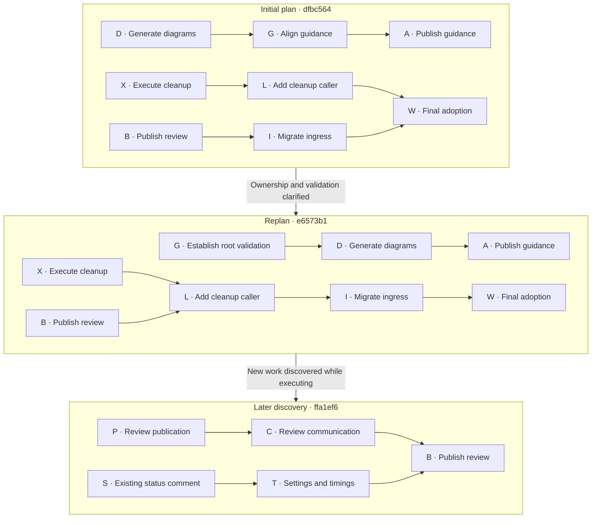
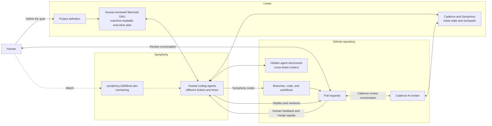

# AI Tinkerers hackathon

Bring a GitHub repository and a real project or problem you want to work on. A
few paragraphs of notes are enough; Markdown documents and other existing
project material are useful. Plan to spend two or three hours in the room. You
will review the proposed work and the resulting pull requests.

## Goal for the day

The alpha release took an agent software-development workflow that worked in one
repository and turned it into a reusable template. Today we test the claim at
the heart of that work: **reuse it, then reuse it again**. We will install the
same system in repositories we did not design it for and use it on real projects
their owners want to move forward.

This is an agent experience inside the places where software engineering already
happens. The human defines the project in Linear and holds the engineering
conversation on GitHub pull requests. Symphony does the coding, Cadence takes
the review journey with the human, and the dashboard provides monitoring. The
plan appears on the pull request page as a Mermaid dependency graph: a picture
the human can question, an artifact both agents can discuss, and an execution
plan Symphony can follow. Linear and GitHub shape how the agents plan,
communicate, respond to feedback, and act; they are not wrappers around a
separate chat window.

By the end of the day, we want to show:

- a complete path from a Linear project definition to Symphony-authored code,
  Cadence review, human feedback, revision, approval, and merge;
- a human-reviewed Mermaid dependency graph that makes the proposed work,
  ordering, and parallelism visible before implementation fans out;
- repeated installation and execution across several participant repositories;
- real development completed on those repositories, not a staged demonstration;
- per-repository evidence of what worked and a concrete defect list wherever the
  reusable workflow failed or needed intervention.

A successful run demonstrates useful, controllable agents native to Linear and
GitHub. A failed run is still a deliverable when its log identifies where the
template, integration, orchestration, or recovery path broke. Together, those
runs test functionality, theme fit, technical integration, reliability, and
usefulness under real conditions.

## What it does

**Software engineering is and has always been a conversation between engineers;
a journey, not a single waterfall.**

Fifty years ago, much of that conversation happened face to face around a
chalkboard; later, around a whiteboard. GitHub took it out of the meeting room
and onto the web, on the pull request page, where the conversation became
durable and asynchronous. 1000lines brings agents into that same conversation
without removing the human decisions.

Coding and review agents already participate in parts of this flow, but they
are rarely immersed in the whole journey. They arrive for one task or one diff,
without the project context, decisions, and feedback that shaped it. Our agents
are there for the journey. Cadence stays with the human across the project's PR
conversation, carrying review context from one decision to the next. Symphony
does the coding: it turns ready work into branches and pull requests, then
revises them in response to the conversation.

You define the project in Linear, then respond to requirements, design, plans,
and working software through GitHub pull requests. Your comments change what
happens next; approval and merge move the project forward.

Both agents join you on the pull request page. Symphony presents its work and
responds to your comments. Cadence explains its review and stays in the review
conversation as the pull request changes.

1000lines provides those two roles. Cadence accompanies the human through the
review journey; Symphony implements the work. Ticket state and workpads carry
context and handoffs across Linear and GitHub. The Symphony UI lets you watch
the work without having to operate it ticket by ticket.

The agents also need their own conversation. Cadence and Symphony communicate
through Linear. Symphony agents working on different tickets, often at different
times, leave context for one another in hidden documents in the repository.
Those channels let later agents continue the journey instead of starting each
task from an isolated prompt.

Some coding agents do not participate in a conversation at all. They suck up the
air with a huge diff, ignore the niceties of the pull request medium, and are
hard to correct. A different response is to set guardrails and a direction, then
get out of the agent's way. That gives the agent room to run, but delays the
moment when a human discovers that it ran in the wrong direction.

1000lines uses a dependency graph of small tasks to keep the work correctable
while it is moving. Projects are cheap enough that a half-finished project going
in the wrong direction does not have to be rescued. Keep what you learned,
discard the project, and start a better one.

### The plan is a Mermaid graph

Every project plan is a Mermaid dependency graph. It renders directly on the
GitHub pull request page, so the human and both agents can discuss the same
picture in the same medium as the rest of the engineering conversation. The
nodes are focused tasks that can become pull requests. The arrows state which
results must exist before other work can begin. Unconnected branches show where
Symphony can work in parallel.

The graph is both a human-readable proposal and Symphony's machine-readable
execution plan. Reviewing it before fan-out makes missing work, false
dependencies, unsafe parallelism, and unnecessary scope visible before they
turn into a pile of code. When implementation changes what the team understands,
the graph changes too. It records the replan instead of pretending the first
plan was final.

### A real replan

The template-enhancement
[`fan-out-plan-100-67-template-enhancements.mmd`](../docs/symphony-plans/fan-out-plan-100-67-template-enhancements.mmd)
has four recorded versions across the repository's branch history. Two changes
substantially altered its structure. This diagram shows only the lanes that
changed:



The [first plan](https://github.com/1000lines/symphony-client-template/commit/dfbc564988876f3b39d76c3a0376eae6ce08782a)
assumed diagrams could precede guidance alignment and that cleanup and review
publication could remain mostly parallel. Eight minutes later, the
[first replan](https://github.com/1000lines/symphony-client-template/commit/e6573b1839f434bba16247598b8c40df5ecca16a)
recorded two discoveries: root validation had to exist before generating files,
so `D → G` became `G → D`; and shared inventory ownership required review
publication, cleanup, and ingress migration to run in order. The longest path
grew from eight rounds to ten rather than hiding those dependencies.

Later, an existing status-comment task became relevant. The
[second structural amendment](https://github.com/1000lines/symphony-client-template/commit/ffa1ef6e19a529a3272d71393c04183118c37b24)
added it as `S` and split presentation from the broader communication task:
`C → T` became `S → T`, while `C → B` preserved the review-publication handoff.
The project kept moving while the graph recorded what the team had learned.

## Architecture



The human works through the Linear project definition and GitHub pull requests.
Cadence and Symphony use Linear to talk to one another; individual ticket state
and workpads support automation and troubleshooting rather than acting as the
participant's day-to-day control surface. Hidden repository documents carry
context between Symphony agents across tickets and time. Symphony does the
coding, Cadence takes the review journey with the human, and the participant
owns approval and merge decisions. The Symphony UI is the monitoring surface.

Create a separate log in this folder for every repository worked on. Name it
`OWNER--REPO.md`, using the working repository's owner and name, and start from
[`repo-log-template.md`](repo-log-template.md). Keep each repository's activity
separate during the event. The logs will be consolidated at the end of the day.

## 1. Join Linear

1. Create a Linear account.
2. Ask Jeremy to add you to the Linear team.
3. Create a Linear API key. Do not paste it into chat, a Copier answer, a commit,
   or an issue.
4. Save the raw key locally at `~/.linear-token`.

## 2. Choose where the repository will live

### Fast bring-your-own path: HackCadence

Keep the repository in its current account or organization and install the
temporary HackCadence GitHub App on only that repository. You need repository
admin access. If GitHub offers **Request** instead of **Install**, ask an
organization owner to approve the installation. If that cannot happen during
the event, use the fork path.

Jeremy will invite you to a private event-credentials repository containing the
HackCadence installation link and temporary settings. Configure these GitHub
Actions settings at repository scope, or through an organization grant that
includes the repository:

| Setting | Kind | Value |
| --- | --- | --- |
| `CADENCE_APP_ID` | Variable | HackCadence's numeric App ID |
| `CADENCE_APP_PRIVATE_KEY` | Secret | The temporary HackCadence PEM |
| `CADENCE_REVIEWER` | Variable | HackCadence's actual `slug[bot]` login |
| `SYMPHONY_BOT_USER` | Variable | `1000lines-symphony[bot]` |
| `CADENCE_LINEAR_API_TOKEN` | Secret | Your Linear API key |
| `CADENCE_AI_REVIEW_ANTHROPIC_API_KEY` | Secret | Your Anthropic API key |
| `CADENCE_CLAUDE_MODEL` | Variable | `claude-opus-5` |

The event uses the tested Claude review path. OpenAI-only review is not part of
this walkthrough yet.

HackCadence is a shared event identity. Its private key can authenticate across
its event installations until it is revoked. At 4 p.m., Jeremy will delete the
HackCadence App, its key, and the private event-credentials repository.

### Isolated bring-your-own path: create a Cadence App

Create a Cadence GitHub App under your personal account or organization and
install it on the target repository. Use these repository permissions:

- Metadata, Contents, and Actions: read
- Pull requests, Issues, and Checks: read and write
- Everything else: no access

Disable webhooks and leave OAuth callbacks, client secrets, and event
subscriptions unused. Retain the App's numeric ID, PEM private key, and actual
`slug[bot]` login, then use them for the Actions settings in the table above.
The Symphony author identity remains `1000lines-symphony[bot]`; its signing key
is managed on the hosted worker.

### Fork path

1. Ask Jeremy to add you to the `1000lines` GitHub organization.
2. Fork your chosen repository into `1000lines`.
3. Clone the fork and enter its root directory.

The `1000lines` organization supplies the App installation, secrets, and
variables, so skip the GitHub App and Actions-setting instructions above. The
fork remains world-readable after the event, so you can copy its work later. At
4 p.m., its automation credentials will be disabled and your write access will
be removed.

## 3. Copy the Symphony/Cadence files

Check out the working repository and enter its root directory. The tested Copier
installation is Homebrew:

```sh
brew install copier
```

Then run:

```sh
copier copy -r main gh:1000lines/symphony-client-template .
```

Answer the prompts as follows:

| Prompt | Answer |
| --- | --- |
| Repository | The working `OWNER/REPO` |
| Default branch | The repository's default branch, usually `main` |
| Linear team key | `100` |
| Symphony App slug | `1000lines-symphony` |
| Cadence App slug | The installed Cadence App's actual slug; ask Jeremy if using the fork path |
| Reviewer | `claude` or `codex`; current execution chooses from the configured provider keys |
| Build command | The repository's build command |
| Test command | The repository's test command |

Review the generated changes, then either commit them directly to the default
branch or merge them through a setup pull request. The generated files must be
on the default branch before continuing.

## 4. Create and start the Linear project

Start Codex from the repository root. Have a conversation about the project:
explain the problem, share your notes and Markdown documents, and answer its
questions. When the project is clear, ask Codex to create a Symphony Linear
project using:

```text
.agents/skills/symphony-project-factory/SKILL.md
```

Choose when work starts:

- Ask Codex to put the tickets in **Active** to start immediately.
- Ask Codex to leave the first ticket in **Backlog** if you want to inspect the
  project in Linear first. Move it to **Active** when you are ready.

An Active ticket means the project has started. Open
<https://symphony.1000lines.dev> to watch Symphony work on it. If expected
activity does not appear, especially the creation of tickets in Linear, ask
Jeremy for help. Individual ticket state is mainly for troubleshooting; do not
manage the project ticket by ticket when the automation is progressing normally.

## 5. Review the work

When Symphony finishes a ticket, review its pull request. Cadence will normally
add an advisory review at low effort for faster event turnaround. Cadence's
approval does not satisfy merge requirements; you remain responsible for the
decision.

The first two pull requests deserve particular attention:

1. **Requirements and design:** confirm the acceptance criteria describe what
   you want and that the proposed approach makes sense.
2. **Plan:** inspect the task boundaries, dependencies, and proposed parallel
   work carefully. This plan controls the implementation fan-out.

For ordinary feedback, use GitHub's **Start a review** flow, collect your inline
comments, and submit them together with **Comment**. Do not approve while you
still want changes. When you are satisfied, submit **Approve** and merge the pull
request yourself. Reserve **Request changes** for a major failure.

Cadence normally decides when a draft is ready for review. If it is stuck asking
for validation that can only happen after merge, use your judgment and mark the
pull request **Ready for review** yourself.

After merge, the project should advance on its own: Linear tickets appear, ready
work starts, and focused implementation pull requests follow. Continue the same
review loop and escalate to Jeremy if the expected activity stops.
