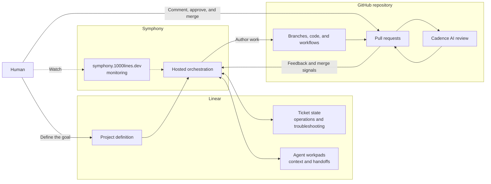

# AI Tinkerers hackathon

Bring a GitHub repository and a real project or problem you want to work on. A
few paragraphs of notes are enough; Markdown documents and other existing
project material are useful. Plan to spend two or three hours in the room. You
will review the proposed work and the resulting pull requests.

## What it does

**Software engineering is and has always been a conversation between engineers;
a journey, not a single waterfall.**

Fifty years ago, much of that conversation happened face to face around a
chalkboard; later, around a whiteboard. GitHub took it out of the meeting room
and onto the web, on the pull request page, where the conversation became
durable and asynchronous. 1000lines brings agents into that same conversation
without removing the human decisions.

Coding and review agents already participate in parts of this flow, but they
are rarely immersed in the whole journey. They arrive for one task or one diff,
without the project context, decisions, and feedback that shaped it. 1000lines
uses project context, ticket state, and agent workpads to carry the conversation
across planning, implementation, review, and revision.

You define the project in Linear, then respond to requirements, design, plans,
and working software through GitHub pull requests. Your comments change what
happens next; approval and merge move the project forward.

Symphony carries the conversation between those human decisions. It coordinates
agents, context, handoffs, and execution state across Linear and GitHub. Cadence
adds a fast, independent AI review. The Symphony UI lets you watch the work
without having to operate it ticket by ticket.

## Architecture



The human works through the Linear project definition and GitHub pull requests.
Individual Linear ticket state and workpads support automation and
troubleshooting; they are not the participant's day-to-day control surface.
Symphony authors the work, Cadence reviews it, and the participant owns approval
and merge decisions. The Symphony UI is the monitoring surface.

Create a separate log in this folder for every repository worked on. Name it
`OWNER--REPO.md`, using the working repository's owner and name, and start from
[`repo-log-template.md`](repo-log-template.md). Keep each repository's activity
separate during the event. The logs will be consolidated at the end of the day.

## 1. Join Linear

1. Create a Linear account.
2. Ask Jeremy to add you to the Linear team.
3. Create a Linear API key. Do not paste it into chat, a Copier answer, a commit,
   or an issue.
4. Save the raw key locally at `~/.linear-token`.

## 2. Choose where the repository will live

### Fast bring-your-own path: HackCadence

Keep the repository in its current account or organization and install the
temporary HackCadence GitHub App on only that repository. You need repository
admin access. If GitHub offers **Request** instead of **Install**, ask an
organization owner to approve the installation. If that cannot happen during
the event, use the fork path.

Jeremy will invite you to a private event-credentials repository containing the
HackCadence installation link and temporary settings. Configure these GitHub
Actions settings at repository scope, or through an organization grant that
includes the repository:

| Setting | Kind | Value |
| --- | --- | --- |
| `CADENCE_APP_ID` | Variable | HackCadence's numeric App ID |
| `CADENCE_APP_PRIVATE_KEY` | Secret | The temporary HackCadence PEM |
| `CADENCE_REVIEWER` | Variable | HackCadence's actual `slug[bot]` login |
| `SYMPHONY_BOT_USER` | Variable | `1000lines-symphony[bot]` |
| `CADENCE_LINEAR_API_TOKEN` | Secret | Your Linear API key |
| `CADENCE_AI_REVIEW_ANTHROPIC_API_KEY` | Secret | Your Anthropic API key |
| `CADENCE_CLAUDE_MODEL` | Variable | `claude-opus-5` |

The event uses the tested Claude review path. OpenAI-only review is not part of
this walkthrough yet.

HackCadence is a shared event identity. Its private key can authenticate across
its event installations until it is revoked. At 4 p.m., Jeremy will delete the
HackCadence App, its key, and the private event-credentials repository.

### Isolated bring-your-own path: create a Cadence App

Create a Cadence GitHub App under your personal account or organization and
install it on the target repository. Use these repository permissions:

- Metadata, Contents, and Actions: read
- Pull requests, Issues, and Checks: read and write
- Everything else: no access

Disable webhooks and leave OAuth callbacks, client secrets, and event
subscriptions unused. Retain the App's numeric ID, PEM private key, and actual
`slug[bot]` login, then use them for the Actions settings in the table above.
The Symphony author identity remains `1000lines-symphony[bot]`; its signing key
is managed on the hosted worker.

### Fork path

1. Ask Jeremy to add you to the `1000lines` GitHub organization.
2. Fork your chosen repository into `1000lines`.
3. Clone the fork and enter its root directory.

The `1000lines` organization supplies the App installation, secrets, and
variables, so skip the GitHub App and Actions-setting instructions above. The
fork remains world-readable after the event, so you can copy its work later. At
4 p.m., its automation credentials will be disabled and your write access will
be removed.

## 3. Copy the Symphony/Cadence files

Check out the working repository and enter its root directory. The tested Copier
installation is Homebrew:

```sh
brew install copier
```

Then run:

```sh
copier copy -r main gh:1000lines/symphony-client-template .
```

Answer the prompts as follows:

| Prompt | Answer |
| --- | --- |
| Repository | The working `OWNER/REPO` |
| Default branch | The repository's default branch, usually `main` |
| Linear team key | `100` |
| Symphony App slug | `1000lines-symphony` |
| Cadence App slug | The installed Cadence App's actual slug; ask Jeremy if using the fork path |
| Reviewer | `claude` or `codex`; current execution chooses from the configured provider keys |
| Build command | The repository's build command |
| Test command | The repository's test command |

Review the generated changes, then either commit them directly to the default
branch or merge them through a setup pull request. The generated files must be
on the default branch before continuing.

## 4. Create and start the Linear project

Start Codex from the repository root. Have a conversation about the project:
explain the problem, share your notes and Markdown documents, and answer its
questions. When the project is clear, ask Codex to create a Symphony Linear
project using:

```text
.agents/skills/symphony-project-factory/SKILL.md
```

Choose when work starts:

- Ask Codex to put the tickets in **Active** to start immediately.
- Ask Codex to leave the first ticket in **Backlog** if you want to inspect the
  project in Linear first. Move it to **Active** when you are ready.

An Active ticket means the project has started. Open
<https://symphony.1000lines.dev> to watch Symphony work on it. If expected
activity does not appear, especially the creation of tickets in Linear, ask
Jeremy for help. Individual ticket state is mainly for troubleshooting; do not
manage the project ticket by ticket when the automation is progressing normally.

## 5. Review the work

When Symphony finishes a ticket, review its pull request. Cadence will normally
add an advisory review at low effort for faster event turnaround. Cadence's
approval does not satisfy merge requirements; you remain responsible for the
decision.

The first two pull requests deserve particular attention:

1. **Requirements and design:** confirm the acceptance criteria describe what
   you want and that the proposed approach makes sense.
2. **Plan:** inspect the task boundaries, dependencies, and proposed parallel
   work carefully. This plan controls the implementation fan-out.

For ordinary feedback, use GitHub's **Start a review** flow, collect your inline
comments, and submit them together with **Comment**. Do not approve while you
still want changes. When you are satisfied, submit **Approve** and merge the pull
request yourself. Reserve **Request changes** for a major failure.

Cadence normally decides when a draft is ready for review. If it is stuck asking
for validation that can only happen after merge, use your judgment and mark the
pull request **Ready for review** yourself.

After merge, the project should advance on its own: Linear tickets appear, ready
work starts, and focused implementation pull requests follow. Continue the same
review loop and escalate to Jeremy if the expected activity stops.
