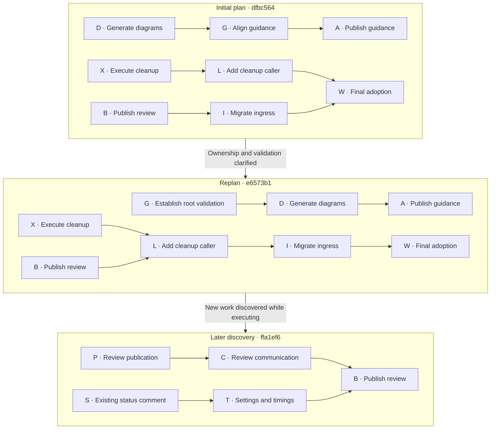
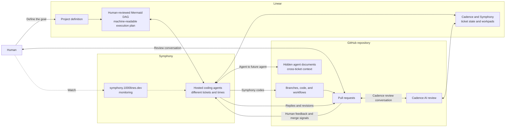

# AI Tinkerers hackathon

Bring a GitHub repository and a real project or problem you want to work on. A
few paragraphs of notes are enough; Markdown documents and other existing
project material are useful. Plan to spend two or three hours in the room. You
will review the proposed work and the resulting pull requests.

## Goal for the day

The alpha release took an agent software-development workflow that worked in one
repository and turned it into a reusable template. Today we test the claim at
the heart of that work: **reuse it, then reuse it again**. We will install the
same system in repositories we did not design it for and use it on real projects
their owners want to move forward.

This is an agent experience inside the places where software engineering already
happens. The human defines the project in Linear and holds the engineering
conversation on GitHub pull requests. Symphony does the coding, Cadence takes
the review journey with the human, and the dashboard provides monitoring. The
plan appears on the pull request page as a Mermaid dependency graph: a picture
the human can question, an artifact both agents can discuss, and an execution
plan Symphony can follow. Linear and GitHub shape how the agents plan,
communicate, respond to feedback, and act; they are not wrappers around a
separate chat window.

By the end of the day, we want to show:

- a complete path from a Linear project definition to Symphony-authored code,
  Cadence review, human feedback, revision, approval, and merge;
- a human-reviewed Mermaid dependency graph that makes the proposed work,
  ordering, and parallelism visible before implementation fans out;
- repeated installation and execution across several participant repositories;
- real development completed on those repositories, not a staged demonstration;
- per-repository evidence of what worked and a concrete defect list wherever the
  reusable workflow failed or needed intervention.

A successful run demonstrates useful, controllable agents native to Linear and
GitHub. A failed run is still a deliverable when its log identifies where the
template, integration, orchestration, or recovery path broke. Together, those
runs test functionality, theme fit, technical integration, reliability, and
usefulness under real conditions.

## What we achieved

The claim under test was reuse: extract a workflow from one repository, then install
and run it in repositories it was not designed for. We installed it in three
participant repositories. Memray reached merged feature code, documentation,
validation and upstream-submission preparation; Venn reached a merged design,
plan, fan-out and first cleanup implementation; ESLint reached merged requirements
and a rule-inventory plan. Those are different stopping points, not three completed
projects. The logs below are earlier snapshots; the GitHub inventory records later
progress without rewriting them.

### Results by repository

- **jeremycarroll/pytest-memray:** Copier, Symphony and HackCadence installed; the human reconciled 13 existing CI checks.
  Symphony produced the full-capture feature, tests, docs and delivery artifacts; PRs #2–#11 merged.
  The log records Cadence review, Jeremy's feedback, Symphony revisions, and Jeremy's approvals/merges, including the delivery replan.
  It stopped at upstream-submission preparation: #11's body still records certification/submission as pending. [Repository log](jeremycarroll--pytest-memray.md).
- **jeremycarroll/venn-search-rs:** Copier, Symphony and HackCadence installed alongside six existing Rust CI checks; Jeremy corrected onboarding and merged it.
  Symphony produced a 631-line design, then a plan, ticket fan-out and recovered cleanup; PRs #17–#20 merged, #21–#27 remained open at the inventory snapshot.
  Jeremy approved and merged the design before Cadence finished; the log records no verdict on #16 or #17. The later cleanup merge is #20.
  It reached implementation, beyond the log's design-only stopping point, but not completion of the cleanup project. [Repository log](jeremycarroll--venn-search-rs.md).
- **1000lines/eslint:** Copier and the organisation's Symphony/Cadence configuration installed via setup PR #1; the human repaired CI and formatting.
  The log records 39 successful setup checks. Later Symphony PRs #2 and #3 merged requirements and the rule-inventory plan, merged by Jeremy.
  PR #3 reports 292 rules inventoried, 37 candidates and six proposed first-wave lanes; it changes planning artifacts, not rule implementations.
  It reached an accepted plan, not six completed lanes or the roughly forty-lane project. [Repository log](1000lines--eslint.md).

Memray supplies the logged path from Linear definition through Symphony-authored
code, Cadence review, human feedback, revision, approval and merge. Its Mermaid
plan was reviewed and extended from three nodes/two edges to five nodes/four
edges after Jeremy changed the delivery requirement. That is evidence of a human
changing the execution plan, not of execution discovering a difficult dependency.
Venn and ESLint subsequently merged their own plans. Installation and execution
were repeated in all three repositories; completed application changes landed in
Memray and Venn. The evidence does not establish the full review journey in all
three. Jeremy's end-of-day assessment was that most of the workflow worked, with
failures concentrated in review delivery, comment cleanup and state transitions.

### PR inventory beyond the log snapshots

GitHub read at **2026-09-12 22:55 UTC**: 26 distinct PRs carrying the
`symphony` label and opened or closed on September 12, 2026 in America/Los_Angeles
(07:00 UTC September 12 through 06:59:59 UTC September 13), across `jeremycarroll`
and `1000lines`: **17 merged, 9 open, 0 closed without merge**.
This counts labels visible at read time, not historical label membership. It
includes workflow development and a test fixture repository; those are not extra
participant-project completions. Setup PRs without that label are outside this
count. Each link below is the PR evidence for its title and state.

| Repository | PR | Work | State at read |
| --- | --- | --- | --- |
| `1000lines/eslint` | [#2](https://github.com/1000lines/eslint/pull/2) | [100-118]: docs: define TypeScript syntax-awareness requirements | Merged |
| `1000lines/eslint` | [#3](https://github.com/1000lines/eslint/pull/3) | [100-119]: docs: plan TypeScript-aware rule delivery | Merged |
| `1000lines/symphony-client-workflows` | [#16](https://github.com/1000lines/symphony-client-workflows/pull/16) | [100-109]: reconcile Linear status when the last PR closes | Merged |
| `1000lines/symphony-client-workflows` | [#18](https://github.com/1000lines/symphony-client-workflows/pull/18) | [100-116]: Prepare dedicated workflow test repository and fixtures | Open |
| `1000lines/test-repo-1` | [#1](https://github.com/1000lines/test-repo-1/pull/1) | [100-116]: Correct installed test repository target and CI | Open |
| `jeremycarroll/pytest-memray` | [#2](https://github.com/jeremycarroll/pytest-memray/pull/2) | [100-101]: document full-capture requirements and design | Merged |
| `jeremycarroll/pytest-memray` | [#3](https://github.com/jeremycarroll/pytest-memray/pull/3) | [100-102]: plan full captures implementation and upstream handoff | Merged |
| `jeremycarroll/pytest-memray` | [#4](https://github.com/jeremycarroll/pytest-memray/pull/4) | [100-103]: record full-captures ticket fan-out | Merged |
| `jeremycarroll/pytest-memray` | [#5](https://github.com/jeremycarroll/pytest-memray/pull/5) | [100-105]: document full captures and downstream reporting | Merged |
| `jeremycarroll/pytest-memray` | [#6](https://github.com/jeremycarroll/pytest-memray/pull/6) | [100-104]: add full allocation captures with regression coverage | Merged |
| `jeremycarroll/pytest-memray` | [#7](https://github.com/jeremycarroll/pytest-memray/pull/7) | [100-106]: Validate full captures and track upstream delivery | Merged |
| `jeremycarroll/pytest-memray` | [#8](https://github.com/jeremycarroll/pytest-memray/pull/8) | [100-107]: Plan clean contribution branch and upstream submission | Merged |
| `jeremycarroll/pytest-memray` | [#9](https://github.com/jeremycarroll/pytest-memray/pull/9) | [100-108]: Apply the accepted delivery ticket fan-out | Merged |
| `jeremycarroll/pytest-memray` | [#10](https://github.com/jeremycarroll/pytest-memray/pull/10) | [100-113]: Prepare concise full-captures upstream PR | Merged |
| `jeremycarroll/pytest-memray` | [#11](https://github.com/jeremycarroll/pytest-memray/pull/11) | [100-114]: Prepare certified full-capture upstream submission | Merged |
| `jeremycarroll/venn-search-rs` | [#17](https://github.com/jeremycarroll/venn-search-rs/pull/17) | [100-110]: Define Venn cleanup requirements and design | Merged |
| `jeremycarroll/venn-search-rs` | [#18](https://github.com/jeremycarroll/venn-search-rs/pull/18) | [100-111]: Plan disjoint Venn cleanup work | Merged |
| `jeremycarroll/venn-search-rs` | [#19](https://github.com/jeremycarroll/venn-search-rs/pull/19) | [100-112]: Map cleanup plan to activated issues | Merged |
| `jeremycarroll/venn-search-rs` | [#20](https://github.com/jeremycarroll/venn-search-rs/pull/20) | [100-123]: Recover PR 14 cleanup with compatibility | Merged |
| `jeremycarroll/venn-search-rs` | [#21](https://github.com/jeremycarroll/venn-search-rs/pull/21) | [100-124]: Own state and indexed undo log; migrate every caller | Open |
| `jeremycarroll/venn-search-rs` | [#22](https://github.com/jeremycarroll/venn-search-rs/pull/22) | [100-125]: Clarify MEMO construction without changing tables | Open |
| `jeremycarroll/venn-search-rs` | [#23](https://github.com/jeremycarroll/venn-search-rs/pull/23) | [100-130]: Isolate Venn fixtures and add missing invariants | Open |
| `jeremycarroll/venn-search-rs` | [#24](https://github.com/jeremycarroll/venn-search-rs/pull/24) | [100-127]: Clarify restriction cascade and central setup | Open |
| `jeremycarroll/venn-search-rs` | [#25](https://github.com/jeremycarroll/venn-search-rs/pull/25) | [100-129]: Clarify engine re-entry and predicate contracts | Open |
| `jeremycarroll/venn-search-rs` | [#26](https://github.com/jeremycarroll/venn-search-rs/pull/26) | [100-126]: Clarify vertex linking and crossing checks | Open |
| `jeremycarroll/venn-search-rs` | [#27](https://github.com/jeremycarroll/venn-search-rs/pull/27) | [100-128]: Bound inactive disconnection helpers | Open |

The shared-workflows merge (#16) added deterministic Linear reconciliation on PR
close. The workflow test work (#18 and `test-repo-1` #1) remained open; opening a
fixture PR does not establish that its test campaign completed.

### Defects and interventions

The following consolidates the three logs, deduplicated by failure mechanism.
These are reported observations, not a claim that every root cause was independently
reproduced. The first three classes are the failures Jeremy highlighted.

1. **Review triggering and completion — Venn:** setup review jobs were skipped on
   #16; #17's review was still running when the human merged and cancelled it.
   The log also records three failed Cadence AI Review Events runs and one failed
   Review Handoff run; their root causes were unread. **ESLint:** no setup review
   was recorded on #1 in its log. A skipped review and a cancelled in-flight review
   are distinct from a completed verdict.
2. **Automated review/comment cleanup — Memray:** #2's publication job refused to
   hide a review that had changed, leaving the original visible and reporting a
   failure despite correct approval/ready/review-request state. This is the logged
   instance of automated output that should have been hidden remaining visible.
3. **Ticket transitions and manual recovery — Venn:** the PR-close reconciliation
   job failed on unlinked setup PR #16 and passed on linked #17; no ticket needed
   a manual move for #16. **Memray:** the log could not determine whether merge-to-Done
   failed or whether Jeremy moved tickets manually. Jeremy reports manual transitions
   during the day; their exact PR/ticket mapping remains TBC below. The shared
   workflows fix is merged, but that does not prove every transition recovered.
4. **Label-helper permissions — Memray and Venn:** `ensure-pr-labels.mjs` returned
   HTTP 403 with narrowed permissions; the existing author App credential could
   apply the labels through a REST fallback. The logs identify a shared helper issue.
5. **Generated CI requires manual integration — Memray and Venn:** both removed a
   redundant generated build/test workflow and registered their existing checks.
   **Memray and ESLint:** the generated required-check list was empty; ESLint's
   planned narrowing was still unwritten in its log.
6. **Generated commands — Memray:** the build command was `true`, YAML block-scalar
   quoting corrupted the test command, and Docker command spelling needed correction.
   **ESLint:** installation needed `--no-package-lock`; the accepted whole-suite test
   command was an expensive inner loop for one-rule changes.
7. **Generated formatting and identities — ESLint:** generated JSON failed its
   Prettier check and `.gitattributes` needed combining. **Venn:** generated App
   slugs needed manual correction to the bot identities.
8. **Unexpanded check names — Venn:** literal GitHub expressions appeared in
   Cadence job names instead of the PR number.
9. **Incomplete runtime bundle — Memray:** compiled DAG modules were absent from
   the hosted tooling checkout; an isolated build of the same revision unblocked it.
10. **DAG content loss — Memray:** rendered ticket payloads omitted inline scope,
    file lists, acceptance checks and validation commands; fan-out transcribed them.
11. **Progress fetcher assumes a current node — Memray:** planning/fan-out seed
    tickets outside the implementation graph required a workaround.
12. **Runner recovery permissions — Memray:** a Python documentation inventory
    connection reset failed docs CI; the App's read-only Actions grant prevented
    a rerun. GitHub now confirms run 34713703824 succeeded on attempt 2; the
    permission limitation remains separate from that recovered network failure.
13. **Browser availability — Memray:** Mermaid verification needed a pinned
    Playwright container because the host had no browser. ESLint PR #3 later
    reports a container fallback for missing native Chrome libraries too.
14. **Dependency-wait churn — Memray:** a completed independent task repeatedly
    resumed while its soft prerequisite remained unchanged.
15. **Linear workspace visibility — all three logs:** the logging sessions reached
    `orchestrabio`, not the `1000lines` team. ESLint's missing-project assertion was
    therefore not proof that no project existed; later #2/#3 link that project.
16. **Unexplained local recovery branch — Memray:** `fix/linear-team-key` had no
    commits and was never pushed; its purpose and any alternative fix are unresolved.

### What was not achieved

- The Memray fork's completed code and submission preparation did not establish
  upstream submission, DCO certification, news-fragment renaming to an observed
  upstream PR number, or upstream acceptance. The log and #11 explicitly leave
  that handoff pending.
- The Venn cleanup project was not complete at the inventory snapshot: seven
  implementation PRs remained open. Its design's 16/17 versus 3/23 solution-count
  discrepancy remains unanswered; recovered cleanup is not a resolution of it.
- ESLint had no completed per-rule implementation in the inventoried PRs. Six lanes
  were proposed out of 37 candidates; neither those six nor the whole project
  was delivered by the plan merge.
- We did not establish a completed Cadence review/feedback/revision cycle in every
  participant repository, unattended installation, or reliable automatic cleanup
  and ticket transitions without human intervention.
- Memray's plan/replan did not demonstrate discovery of a nontrivial dependency.
  Nor do the snapshots establish the promised final credential/access cutoff or
  completion of the separate workflow-test campaign.

The unresolved questions from the logs are retained below. Later PR merges do
not answer them. The rerun question has GitHub evidence above, but is also retained
so the original log's open question remains traceable.

**From [jeremycarroll--pytest-memray.md](jeremycarroll--pytest-memray.md):**

- `2fb5c3b` 08:09: removed `Run zizmor 🌈` from `requiredChecks` and switched `zizmor.yml` from `push`/`pull_request` to `workflow_dispatch`. TBC — Jeremy: did zizmor fail on the Copier-generated workflows, or was this pre-emptive?
- **Actions grant is read-only** (#8). Push Run [34713703824](https://github.com/jeremycarroll/pytest-memray/actions/runs/34713703824) failed when `docs.python.org/3/objects.inv` reset the connection; the App's rerun attempt returned `Resource not accessible by integration`. TBC — Jeremy: was that run ever rerun green?
- **Local branch `fix/linear-team-key`**: local clone only, created from `HEAD` at 08:10 (the PR #1 merge), zero commits, identical to `main`, never pushed, never a PR. The Copier answer `linear_team_key: '100'` matches the template default and README. TBC — Jeremy: what was this branch for, and was the problem it was named for fixed another way?
- TBC — Jeremy: did any merged PR here fail to move its ticket to Done, and did you move any manually?
- TBC — Jeremy: the template README gained its "Known defect" note at 11:07 today, mid-run — was it this repository that triggered it?

**From [jeremycarroll--venn-search-rs.md](jeremycarroll--venn-search-rs.md):**

- TBC — Jeremy: why was #15 abandoned rather than merged — template revision, the deferred Cadence caller, or something else?
- TBC — Jeremy: what does the "Reconcile current PR associations" step log say — is it the unlinked-PR case failing loudly, or a genuine Linear API/permission failure?
- TBC — Jeremy: what are `Cadence AI Review Events` and `Cadence Review Handoff` failing on after merge?
- TBC — Jeremy: what does "the full Rust workload" (100-96) actually cover, is it venn-search-rs, and has the rehearsal it refers to happened?
- TBC — Jeremy: is the 16/17 vs 3/23 discrepancy a stale brief, or a real regression in the N=4/N=5 tests on main?

**From [1000lines--eslint.md](1000lines--eslint.md):**

- Linear project: TBC — Jeremy. No project or ticket for this work is visible from the Linear connection available here, which reaches workspace `orchestrabio` (teams `Symphony`/ABC and `Orchestra`). Team key `100` is not in that workspace. Which Linear workspace holds team 100, and has the project been created there yet?
- TBC — Jeremy: has this probe been run yet? It is not visible from here, and the available GitHub tooling cannot list workflow-dispatch runs.
- TBC — Jeremy: which ubuntu leg is the gating one, and does an empty `requiredChecks` mean "none gate" or "fall back to all"?
- TBC — Jeremy: confirm a first wave of six lanes?
- What was completed: TBC — Jeremy
- What remains: TBC — Jeremy
- Where to retrieve the work: TBC — Jeremy
- Follow-up: TBC — Jeremy

## What it does

**Software engineering is and has always been a conversation between engineers;
a journey, not a single waterfall.**

Fifty years ago, much of that conversation happened face to face around a
chalkboard; later, around a whiteboard. GitHub took it out of the meeting room
and onto the web, on the pull request page, where the conversation became
durable and asynchronous. 1000lines brings agents into that same conversation
without removing the human decisions.

Coding and review agents already participate in parts of this flow, but they
are rarely immersed in the whole journey. They arrive for one task or one diff,
without the project context, decisions, and feedback that shaped it. Our agents
are there for the journey. Cadence stays with the human across the project's PR
conversation, carrying review context from one decision to the next. Symphony
does the coding: it turns ready work into branches and pull requests, then
revises them in response to the conversation.

You define the project in Linear, then respond to requirements, design, plans,
and working software through GitHub pull requests. Your comments change what
happens next; approval and merge move the project forward.

Both agents join you on the pull request page. Symphony presents its work and
responds to your comments. Cadence explains its review and stays in the review
conversation as the pull request changes.

1000lines provides those two roles. Cadence accompanies the human through the
review journey; Symphony implements the work. Ticket state and workpads carry
context and handoffs across Linear and GitHub. The Symphony UI lets you watch
the work without having to operate it ticket by ticket.

The agents also need their own conversation. Cadence and Symphony communicate
through Linear. Symphony agents working on different tickets, often at different
times, leave context for one another in hidden documents in the repository.
Those channels let later agents continue the journey instead of starting each
task from an isolated prompt.

Some coding agents do not participate in a conversation at all. They suck up the
air with a huge diff, ignore the niceties of the pull request medium, and are
hard to correct. A different response is to set guardrails and a direction, then
get out of the agent's way. That gives the agent room to run, but delays the
moment when a human discovers that it ran in the wrong direction.

1000lines uses a dependency graph of small tasks to keep the work correctable
while it is moving. Projects are cheap enough that a half-finished project going
in the wrong direction does not have to be rescued. Keep what you learned,
discard the project, and start a better one.

### The plan is a Mermaid graph

Every project plan is a Mermaid dependency graph. It renders directly on the
GitHub pull request page, so the human and both agents can discuss the same
picture in the same medium as the rest of the engineering conversation. The
nodes are focused tasks that can become pull requests. The arrows state which
results must exist before other work can begin. Unconnected branches show where
Symphony can work in parallel.

The graph is both a human-readable proposal and Symphony's machine-readable
execution plan. Reviewing it before fan-out makes missing work, false
dependencies, unsafe parallelism, and unnecessary scope visible before they
turn into a pile of code. When implementation changes what the team understands,
the graph changes too. It records the replan instead of pretending the first
plan was final.

### A real replan

The template-enhancement
[`fan-out-plan-100-67-template-enhancements.mmd`](../docs/symphony-plans/fan-out-plan-100-67-template-enhancements.mmd)
has four recorded versions across the repository's branch history. Two changes
substantially altered its structure. This diagram shows only the lanes that
changed:



The [first plan](https://github.com/1000lines/symphony-client-template/commit/dfbc564988876f3b39d76c3a0376eae6ce08782a)
assumed diagrams could precede guidance alignment and that cleanup and review
publication could remain mostly parallel. Eight minutes later, the
[first replan](https://github.com/1000lines/symphony-client-template/commit/e6573b1839f434bba16247598b8c40df5ecca16a)
recorded two discoveries: root validation had to exist before generating files,
so `D → G` became `G → D`; and shared inventory ownership required review
publication, cleanup, and ingress migration to run in order. The longest path
grew from eight rounds to ten rather than hiding those dependencies.

Later, an existing status-comment task became relevant. The
[second structural amendment](https://github.com/1000lines/symphony-client-template/commit/ffa1ef6e19a529a3272d71393c04183118c37b24)
added it as `S` and split presentation from the broader communication task:
`C → T` became `S → T`, while `C → B` preserved the review-publication handoff.
The project kept moving while the graph recorded what the team had learned.

## Architecture



The human works through the Linear project definition and GitHub pull requests.
Cadence and Symphony use Linear to talk to one another; individual ticket state
and workpads support automation and troubleshooting rather than acting as the
participant's day-to-day control surface. Hidden repository documents carry
context between Symphony agents across tickets and time. Symphony does the
coding, Cadence takes the review journey with the human, and the participant
owns approval and merge decisions. The Symphony UI is the monitoring surface.

Create a separate log in this folder for every repository worked on. Name it
`OWNER--REPO.md`, using the working repository's owner and name, and start from
[`repo-log-template.md`](repo-log-template.md). Keep each repository's activity
separate during the event. The logs will be consolidated at the end of the day.

## 1. Join Linear

1. Create a Linear account.
2. Ask Jeremy to add you to the Linear team.
3. Create a Linear API key. Do not paste it into chat, a Copier answer, a commit,
   or an issue.
4. Save the raw key locally at `~/.linear-token`.

## 2. Connect Linear to a bring-your-own repository

If you are keeping the repository in its current account or organization,
Linear's GitHub integration must include that GitHub owner. Otherwise, merging
a linked pull request will not move its Linear ticket to Done. Participants
using the `1000lines` fork path can skip this section because that owner is
already connected.

1. Open [Linear's GitHub integration settings](https://linear.app/settings/integrations/github).
2. Add or connect the GitHub owner that owns the target repository. For
   `jeremycarroll/pytest-memray`, connect **jeremycarroll**.
3. Install Linear's GitHub App for that owner and grant it access to the target
   repository. For this test, include **pytest-memray**.
4. In Linear's GitHub workflow settings for team **100**, confirm that the
   **PR merged** target state is **Done**.
5. Test the connection with a new pull request whose title or branch name
   contains a team-100 issue identifier such as `100-NNN`. Merge the pull
   request, then confirm that Linear moves the matching ticket to Done.

Closing a pull request without merging it does not exercise the **PR merged**
workflow and should not be expected to move the ticket to Done.

## 3. Choose where the repository will live

### Required for either bring-your-own path: install Symphony

Install the
[`1000lines-symphony` GitHub App](https://github.com/apps/1000lines-symphony/installations/new)
on the target repository:

1. Open the installation link and choose the personal account or organization
   that owns the repository.
2. Choose **Only select repositories** and select the target repository.
3. Review the permissions, then choose **Install**. The App reads Actions and
   checks and writes contents, workflows, issues, and pull requests so Symphony
   can create branches and PRs and respond to feedback.
4. If GitHub offers **Request** instead of **Install**, ask an organization owner
   to approve it. If approval cannot happen during the event, use the fork path.

You do not receive or configure this App's private key. Its signing key stays on
the hosted Symphony worker. The Cadence review App is installed separately using
one of the next two paths.

### Fast bring-your-own path: HackCadence

Keep the repository in its current account or organization and
[`install HackCadence`](https://github.com/apps/hackcadence/installations/new)
on only that repository:

1. Open the installation link and choose the personal account or organization
   that owns the repository.
2. Choose **Only select repositories** and select the target repository.
3. Review the grants, then choose **Install**. You need repository admin access.
4. If GitHub offers **Request** instead of **Install**, ask an organization owner
   to approve it. If approval cannot happen during the event, use the fork path.

Installing the App and configuring its Actions settings are separate steps; do
both for the same target repository.

Jeremy will invite you to a private event-credentials repository containing the
temporary private key. Configure these GitHub Actions settings at repository
scope, or through an organization grant that includes the repository:

| Setting | Kind | Value |
| --- | --- | --- |
| `CADENCE_APP_ID` | Variable | `4921338` |
| `CADENCE_APP_PRIVATE_KEY` | Secret | The temporary HackCadence PEM |
| `CADENCE_REVIEWER` | Variable | `hackcadence[bot]` |
| `SYMPHONY_BOT_USER` | Variable | `1000lines-symphony[bot]` |
| `CADENCE_LINEAR_API_TOKEN` | Secret | Your Linear API key |
| `CADENCE_OPENAI_API_KEY` | Secret | Your OpenAI API key for Codex review |
| `CADENCE_AI_REVIEW_ANTHROPIC_API_KEY` | Secret | Your Anthropic API key |
| `CADENCE_CLAUDE_MODEL` | Variable | `claude-opus-5` |

At least one provider key is required. An OpenAI key selects Codex, including
when both provider keys are present. Otherwise, an Anthropic key selects Claude
and requires `CADENCE_CLAUDE_MODEL=claude-opus-5`. The Claude path is tested;
the OpenAI-only event path still needs testing.

HackCadence is a shared event identity. Its private key can authenticate across
its event installations until it is revoked. At 4 p.m., Jeremy will delete the
HackCadence App, its key, and the private event-credentials repository.

### Isolated bring-your-own path: create a Cadence App

Create a Cadence GitHub App under your personal account or organization and
install it on the target repository. Use these repository permissions:

- Metadata, Contents, and Actions: read
- Pull requests, Issues, and Checks: read and write
- Everything else: no access

Disable webhooks and leave OAuth callbacks, client secrets, and event
subscriptions unused. Retain the App's numeric ID, PEM private key, and actual
`slug[bot]` login, then use them for the Actions settings in the table above.
The Symphony author identity remains `1000lines-symphony[bot]`; its signing key
is managed on the hosted worker.

### Fork path

1. Ask Jeremy to add you to the `1000lines` GitHub organization.
2. Fork your chosen repository into `1000lines`.
3. Clone the fork and enter its root directory.

The `1000lines` organization supplies the App installation, secrets, and
variables, so skip the GitHub App and Actions-setting instructions above. The
fork remains world-readable after the event, so you can copy its work later. At
4 p.m., its automation credentials will be disabled and your write access will
be removed.

## 4. Copy the Symphony/Cadence files

Check out the working repository and enter its root directory. The tested Copier
installation is Homebrew:

```sh
brew install copier
```

Then run:

```sh
copier copy -r main gh:1000lines/symphony-client-template .
```

Answer the prompts as follows:

| Prompt | Answer |
| --- | --- |
| Repository | The working `OWNER/REPO` |
| Default branch | The repository's default branch, usually `main` |
| Linear team key | `100` |
| Symphony App slug | `1000lines-symphony` |
| Cadence App slug | `hackcadence` for HackCadence; otherwise the installed App's actual slug |
| Reviewer | `claude` or `codex`; current execution chooses from the configured provider keys |
| Build command | The repository's build command |
| Test command | The repository's test command |

Review the generated changes and open the first setup pull request. Its CI will
probably need work: Copier adds Symphony CI files, but it cannot infer how the
repository's existing CI is structured or which checks it produces.

From the repository root, open Codex or Claude and ask it to connect the new
Symphony CI from Copier to the existing CI. Have it inspect both systems,
preserve the working application workflows, align the build and test commands,
and configure Symphony to recognize the real checks produced for the current PR
head. Add that integration to the same setup PR and let its CI run again.

A useful prompt is:

```text
Inspect this repository's existing CI and the Symphony CI/configuration added by
Copier. Connect them so the existing application checks still run and Symphony
can recognize the required current-head CI results. Preserve existing workflows,
update the generated Symphony configuration and callers where needed, run the
available checks, and add the changes to this setup PR.
```

Review and merge the setup PR only when its CI behavior is understood and the
integration is ready. The generated files must be on the default branch before
continuing.

Before creating the Linear project, run the generated **Symphony Client Setup**
workflow from the repository's Actions page, or use:

```sh
gh workflow run symphony-client-setup.yml --repo OWNER/REPO --ref DEFAULT_BRANCH
```

Inspect both **Check repository-visible settings** and **Verify job-visible
credentials**. Both jobs must pass. This probe catches a missing App
installation, a repository omitted from the installation, an incorrect App ID
or private key, and missing Linear or provider credentials before the first
live Cadence review. Fix the named input before retrying the workflow.

## 5. Set the shared tooling checkout

Clone `symphony-example` as a separate checkout outside the repository you are
working on:

```sh
git clone https://github.com/1000lines/symphony-example.git /absolute/path/to/symphony-example
```

Use the real absolute path on your machine. Start Codex from the participant
repository and tell it:

```text
Use /absolute/path/to/symphony-example as SYMPHONY_TOOLING_ROOT for this session.
```

Alternatively, export the value in the shell before starting Codex:

```sh
export SYMPHONY_TOOLING_ROOT=/absolute/path/to/symphony-example
```

`SYMPHONY_TOOLING_ROOT` points to shared Symphony planning and proof tooling; it
must not point to the participant repository.

## 6. Create and start the Linear project

Start Codex from the repository root. Have a conversation about the project:
explain the problem, share your notes and Markdown documents, and answer its
questions. When the project is clear, ask Codex to create a Symphony Linear
project using:

```text
.agents/skills/symphony-project-factory/SKILL.md
```

Choose when work starts:

- Ask Codex to put the tickets in **Active** to start immediately.
- Ask Codex to leave the first ticket in **Backlog** if you want to inspect the
  project in Linear first. Move it to **Active** when you are ready.

An Active ticket means the project has started. Open
<https://symphony.1000lines.dev> to watch Symphony work on it. If expected
activity does not appear, especially the creation of tickets in Linear, ask
Jeremy for help. Individual ticket state is mainly for troubleshooting; do not
manage the project ticket by ticket when the automation is progressing normally.

## 7. Review the work

When Symphony finishes a ticket, review its pull request. Cadence will normally
add an advisory review at low effort for faster event turnaround. Cadence's
approval does not satisfy merge requirements; you remain responsible for the
decision.

The first two pull requests deserve particular attention:

1. **Requirements and design:** confirm the acceptance criteria describe what
   you want and that the proposed approach makes sense.
2. **Plan:** inspect the task boundaries, dependencies, and proposed parallel
   work carefully. This plan controls the implementation fan-out.

For ordinary feedback, use GitHub's **Start a review** flow, collect your inline
comments, and submit them together with **Comment**. Do not approve while you
still want changes. When you are satisfied, submit **Approve** and merge the pull
request yourself. Reserve **Request changes** for a major failure.

Cadence normally decides when a draft is ready for review. If it is stuck asking
for validation that can only happen after merge, use your judgment and mark the
pull request **Ready for review** yourself.

After merge, the project should advance on its own: Linear tickets appear, ready
work starts, and focused implementation pull requests follow. Continue the same
review loop and escalate to Jeremy if the expected activity stops.
